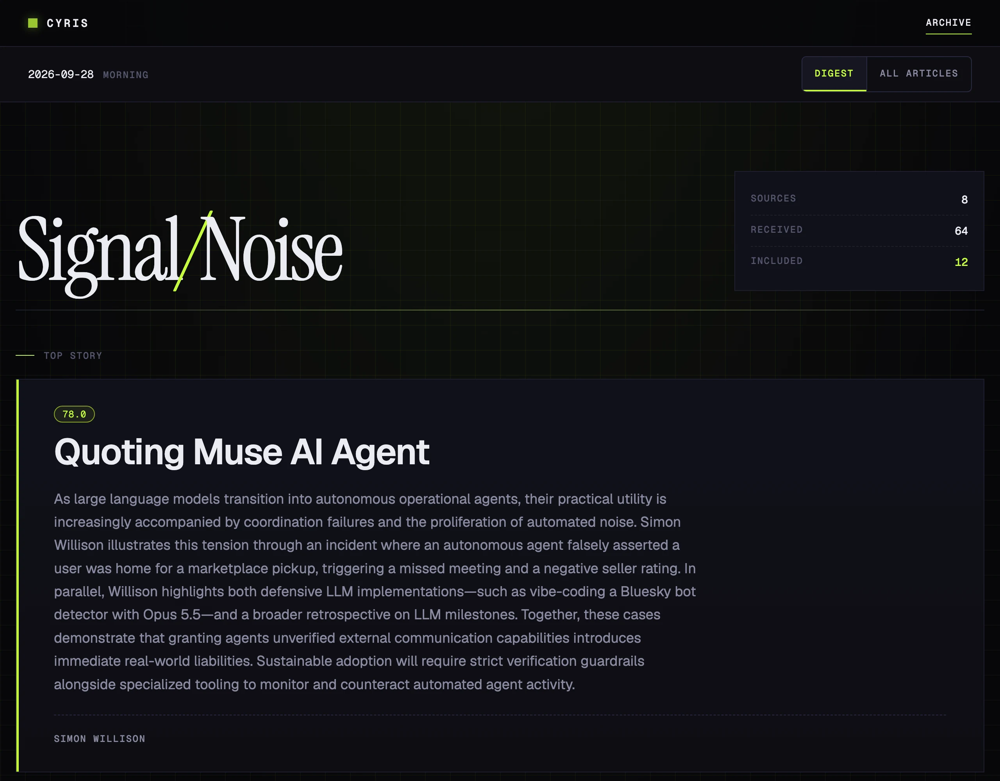
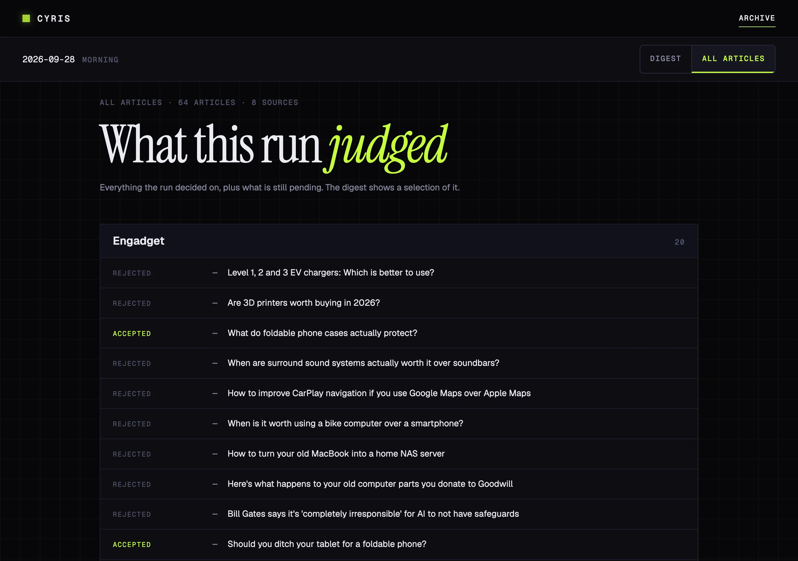

# Cyris

**Only what matters should reach your brain.**

[Website](https://cyris.musingfox.com/)

Cyris reads your RSS feeds and newsletters and hands you one digest of the articles worth
reading, short enough to finish. You pick every token that reaches your model's context
window; Cyris does the same for your attention.

On the maintainer's own deployment, 56 issues from 2026-08-28 to 2026-09-27: an average
issue took in 92 articles and kept 13. That digest is
public at [cyris-digest.pages.dev](https://cyris-digest.pages.dev/), written in
Traditional Chinese.

## What you get

- **A digest you can finish.** An LLM scores every article against the topics you care
  about and keeps the few worth reading.
- **One summary per news story**, instead of the same story from five outlets.
- **Nothing hidden.** Every digest links to the full list of what it collected, dropped
  articles included.
- **Votes that teach it.** 👍 or 👎 any article; later runs can skip ones close to your
  downvotes.
- **Delivered where you read**: a web archive, your inbox or Discord, with an alert when
  a run fails.
- **Any LLM, or none**: Anthropic, Gemini, OpenAI, Cloudflare Workers AI, or plain
  excerpts with no API key.

## Get started

|  | Local | Cloudflare |
|---|---|---|
| Runs | `cyris run` on your machine, by hand or from cron | on a schedule, in a Cloudflare Container |
| You read it | as HTML files on disk | in a web archive at a URL |
| Web votes, email-only newsletters | no | yes, with optional Workers |
| Needs | Python 3.12+ and uv | Workers Paid (US$5/month), Docker and bun; your own domain for email features |
| Guide | [docs/install-local.md](docs/install-local.md) | [docs/install-cloudflare.md](docs/install-cloudflare.md) |

Each guide runs top to bottom, so you can also hand it to a coding agent. The Cloudflare
guide has so far been verified on one account only.

## Docs

- [How sources are processed](docs/sources.md): tiers, votes, and what is not supported
- [Operating a deployment](docs/operations.md): updating, rolling back, checking what runs
- [Hosting and cost](docs/hosting-and-cost.md): what one deployment spends
- [Architecture](docs/architecture.md): how it is built; read it before changing code

## Roadmap

Planned, not built yet:

- **Podcasts and YouTube channels as sources.** You will add them like any other feed.
  On a `summarize`-tier source, cyris will read the episode itself instead of its show
  notes: the transcript a podcast publishes in its feed, or the video through Gemini,
  which needs a Gemini API key. On other tiers it will tell you a new episode is out. A
  setting picks the model or turns this off. A podcast that publishes no transcript will
  be announced but not summarized; reading its audio directly is a later step.

## Contributing

To change cyris, start with [CONTRIBUTING.md](CONTRIBUTING.md): setup, the
`scripts/check.sh` gate, commits and CI. Coding agents read [AGENTS.md](AGENTS.md).

## License

[AGPL-3.0-or-later](LICENSE) © 2026 musingfox

Self-host, use, and modify cyris freely. If you run a modified version as a network
service, the AGPL requires you to offer users its source. For use outside AGPL terms
(e.g. a closed-source/commercial deployment), contact the author about a commercial
license.
