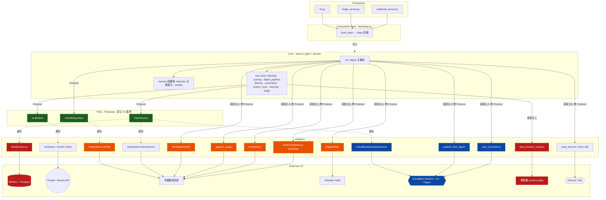

# 架構：Core ↔ Adapter 串接

> 為 dockerize / 上雲決策而畫。凸顯哪些邊界有 Protocol（乾淨可抽換）、哪些是直接注入（上雲要動）。
> 串接真相來源：`bootstrap.py`（誰注入誰）+ `service_layer/ports.py`（邊界契約）。

## 串接圖

**圖例**：🟢 Protocol 邊界（抽換乾淨）　🟠 直接注入的本機檔案 sink（上雲要動、無 Protocol 保護）　🔴 本機/macOS 硬綁　🔵 已雲端

## 關鍵：兩種串接方式

`bootstrap.build_deps()` 把所有 adapter 塞進 `Deps` 容器注入 core。但 core 取用它們有**兩種強度**：

| 串接方式 | 對象 | 抽換難度 |
|----------|------|----------|
| **經 Protocol**（`ports.py`）| `LLMClient`、`ArticleRepository`（ArticleStore 結構化滿足）、`FetchSource` | **低**——換實作不動 core，契約已定 |
| **直接注入具體實作**（無 Protocol）| DigestWriter、HtmlDigestWriter、publish、sync_promotions、EventStore、tracking、append_usage、cookies、notify | **中**——core 直接呼叫，換後端需先抽 Protocol 或改實作 |

`ports.py` 註解點明設計意圖：「Only genuine IO boundaries get a Protocol；single-implementation components are injected directly.」——目前這些 sink 只有一種實作，所以沒抽 Protocol。上雲要加第二種實作（R2/D1）時，這是第一個要補的邊界。

## Dockerize / 上雲抽換點對照

| 元件 | 現況 | Dockerize（本地） | 上雲（Cloudflare） |
|------|------|-------------------|--------------------|
| ArticleStore 🟠 | JSON @ 本機 | volume mount，不改 | 抽 Protocol → R2/D1 實作 |
| EventStore / usage / tracking 🟠 | 檔案 | volume mount，不改 | 同上，換 R2/D1 |
| DigestWriter 🟠 | 寫 Obsidian vault | vault volume mount | 停用（改 HtmlDigestWriter→R2/Pages）|
| LLMClient 🟢 | Anthropic/Gemini | 不改 | 不改（本來就雲端）|
| FetchSource · Miniflux 🔴 | 自架 Docker | compose 已有 | 退場，cyris 自抓 RSS |
| FetchSource · CloudflareNewsletter 🔵 | Worker+KV | 不改 | 不改 |
| load_cookies 🔴 | 讀瀏覽器 sqlite | mount 宿主 cookie（暫緩）| 失去自動保鮮（暫緩）|
| publish / sync_promotions 🔵 | Cloudflare | 不改 | 不改 |
| 排程 | launchd | cron | Workers Cron Trigger |

**結論**：core（service_layer + domain）在三種部署下**完全不動**。所有變化都收斂在 adapter 層——這正是 Protocol + composition root 設計的紅利。Dockerize 只需 volume mount（🟠 全部原地）；上雲才需要把 🟠 抽 Protocol 換 R2/D1。
