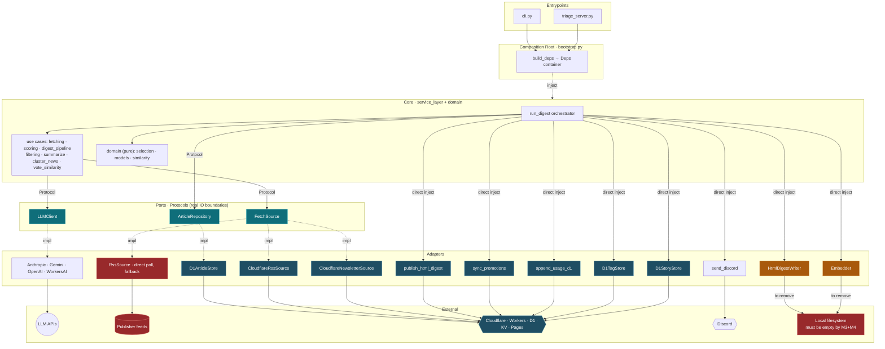
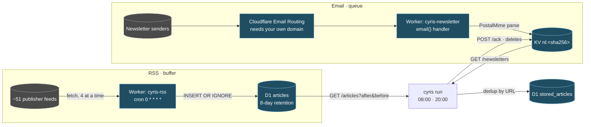

# Architecture

> Three questions this document answers: **who calls whom**, **how articles get in**, and
> **where each piece of data lives**. The last one is what breaks during a migration, and it had no
> written home here until 2026-08-27.
>
> Source of truth: `bootstrap.py` (who injects what), `service_layer/ports.py` (boundary
> contracts), `adapters/store/schema.sql` (what D1 holds), `workers/*/src/index.js` (ingestion).
>
> **This document drives the work.** Everything still to be built is listed in
> [§7 Not built yet](#7-not-built-yet), with its ticket. A destination named anywhere else in this
> document must appear there too — if it doesn't, the list is stale, not the plan.

## 1. Layers

```
entrypoints  →  service_layer  →  domain
                     ↑
                  adapters   (implement the service layer's Protocols)
```

`bootstrap.build_deps()` is the only place the three meet. The core (`service_layer` + `domain`)
imports nothing from `adapters` — it names Protocols, and the composition root supplies bodies.

Pipeline: **Fetch → Store → Score → Process → Output**, orchestrated end to end by
`service_layer/run_digest.py`. The CLI parses arguments and calls it; it holds no logic of its own.

## 2. Wiring



**Legend**: 🟢 Protocol boundary　🟠 still writes local files, must move　🔴 must not exist in the
target architecture　🔵 already on Cloudflare

### No Obsidian writer — deleted 2026-08-27 (M1)

`DigestWriter` — the Obsidian markdown note — is **gone**. The digest's output is the HTML digest on
Cloudflare Pages, plus the article store in D1. A reader who wants the digest in Obsidian exports it
themselves from either.

It took its whole dependency cone with it: `adapters/output/digest.py`, `adapters/output/
article_export.py`, `cyris.toml [obsidian]`, the `CYRIS_VAULT_PATH` environment variable, the vault
bind mount in `docker-compose.yml`, `cyris articles export`, and the vault export that ran on a
triage accept. `--dry-run` renders the HTML instead.

### Local filesystem is a defect, not a tier

A cloud system has no local disk. Three edges still touch one, and each has a destination:

| Edge | What it writes | Destination |
|---|---|---|
| `HtmlDigestWriter → FS` | digest + raw pages, then `wrangler pages deploy` | **R2** |
| `Embedder → FS` | `embeddings.json` (322 MB), rewritten whole every run | **Vectorize** |
| `NewsletterArchiveSource ← FS` | local maildir, superseded by the newsletter Worker | **deleted** |

**`cloud-p3` is done exactly when the `Local filesystem` node disappears from the diagram above.**
That is the acceptance test; anything else is progress reporting.

### Two wiring strengths

| Wiring | Targets | Swap difficulty |
|---|---|---|
| **Via Protocol** (`ports.py`) | `LLMClient`, `ArticleRepository`, `FetchSource` | **Low** — swapping the implementation never touches the core |
| **Direct injection** (no Protocol) | `HtmlDigestWriter`, `publish`, `sync_promotions`, `append_usage`, `notify`, embedder, `D1TagStore`, `D1StoryStore` | **Medium** — the core calls them directly; a second backend needs a Protocol first |

`ports.py`'s rule: *only genuine IO boundaries get a Protocol; single-implementation components are
injected directly.*

One constraint shapes the store: **`ArticleRepository` is synchronous.** `run_digest` never awaits
it, so `D1ArticleStore` uses a blocking HTTP client. Making it async would push `async` through
`service_layer/`, which the cloud migration explicitly promised not to touch.

## 3. How a digest is made

### 3.1 Two ingestion paths



**RSS — a buffer, read idempotently.** `workers/rss` polls every feed on the hour, four at a time
(ten at once drew HTTP 429s from Substack). Entries older than the 8-day retention window are
dropped *before* the write — blogs ship months of history in their feed, and inserting then pruning
them burned ~1.5k writes per tick against D1's daily quota. Writes are `INSERT OR IGNORE`, so
re-seeing an entry every hour is free. `cyris` reads a time window with
`GET /articles?after=&before=`; **there is no ack**, so a crashed digest simply reads the window
again.

The buffer exists because a digest-time poll only sees each feed's current snapshot — 2–4 hours for
a busy feed, not 24. Measured: a digest-time poll missed 141 of 317 articles. `RssSource` (direct
polling) remains as the no-Worker fallback and is correct only for slow feeds.

**Email — a queue, drained with an ack.** Cloudflare Email Routing delivers to the `email()` handler
in `workers/newsletter`, which parses the message with PostalMime and stores
`{from, subject, html, text, date}` in KV under `nl:<sha256(from|subject|date)>` — so a re-delivered
copy overwrites instead of duplicating. `cyris` pulls with `GET /newsletters`, matches each sender
to a source via that source's `email_match`, and then `POST /ack` **deletes** what it processed.
Unmatched senders and private replies are ACKed without ingesting, so they cannot pile up.

| | RSS | Email |
|---|---|---|
| Shape | buffer | queue |
| Read | idempotent time window | pull + ack |
| Crash mid-run | reread, nothing lost | loses at most the current batch |
| Retention | 8 days, pruned by the Worker | until ACKed |
| Needs your own domain | no | **yes** — Email Routing cannot run on `*.workers.dev` |

Each newsletter issue also needs a canonical article link. That extraction is structural, not a
hostname allowlist, and has its own rule set — see
[the newsletter link section in CLAUDE.md](../CLAUDE.md) before touching
`adapters/fetch/newsletter.py`.

### 3.2 From articles to a digest

`fetch_all_articles` merges every `FetchSource`, **deduplicating by URL — last source wins**. A
source that throws is logged and skipped; the run continues degraded rather than failing.

Everything then goes to the store, and the store's `url` PRIMARY KEY is the second dedup: an article
seen in a previous window is not processed again.

Each source carries a **tier**, which decides how much attention it gets:

| Tier | Treatment |
|---|---|
| `filter` | Batched headline extraction, aggressively discarded (<10% pass). News-tagged articles are additionally clustered by topic. |
| `summarize` | Scored by the LLM, then split by `[routing] summarize_score_threshold` into full summaries and brief mentions. |
| `fan` | Passthrough. Never scored, filtered, or summarized — followed groups and newsletters go straight through. |

Between scoring and the pipeline one optional filter runs. **Vote similarity** suppresses candidates
sitting close to a downvoted article — it runs over *every* candidate, not just scored ones, because
the scorer skips news and the first downvote was news-tagged. It is the only personalization in the
pipeline: prompt-level preference learning was removed on 2026-08-27 because it had never produced a
profile.

Two analytics facts are persisted beside the digest, both fail-soft — a write failure is logged
and the run continues. Topic tags emitted by scoring and by news clustering land normalized in D1
`tags`/`article_tags` (`D1TagStore`), and each run's pre-truncation story membership — which
articles the clustering step grouped, including members the output cap dropped — replaces its
(date, period) window in `stories`/`story_members` (`D1StoryStore`). Both stores are direct
injections built only when D1 is configured; with `backend = "json"` they are absent and the run
skips the writes.

Output is the HTML digest and a companion raw page listing everything the window collected —
uncapped and unfiltered, so what the digest dropped stays visible — both deployed to Cloudflare
Pages, followed by a Discord notification. Votes cast on the published digest go to the promote
Worker's KV and are drained hourly by `cyris promote-sync`, which is what turns a click into a
`triaged_at` stamp.

## 4. Data residency

Every persistent datum, where it lives now, and where it is going.

| Datum | Today | Destination | Notes |
|---|---|---|---|
| Article store | **D1 `stored_articles`** | same | `url` PRIMARY KEY is the dedup key |
| Tag vocabulary | **D1 `tags`** | same | Normalized tags emitted by clustering and scoring |
| Article tags | **D1 `article_tags`** | same | URL-keyed article membership in the tag vocabulary |
| Stories | **D1 `stories`** | same | Pre-truncation news clusters, keyed `{date}-{period}-{urlhash}` (content-derived from member URLs), replaced per window |
| Story membership | **D1 `story_members`** | same | URL-keyed article membership in each story |
| RSS buffer | **D1 `articles`** | same | Same database, different lifecycle: disposable, 8-day retention |
| Source definitions | **D1 `sources`** + `sources.yaml` fallback | same | Both cyris and `workers/rss` read it |
| Runtime settings | **D1 `settings`** + `cyris.toml` fallback | same | Grade D. D1 first, always — see §5 |
| LLM spend | **D1 `usage_log`** | same | `usage.jsonl` is its retired predecessor |
| Promote votes | **KV** (`workers/promote`) | same | Transient queue, drained hourly |
| Inbound newsletters | **KV** (`workers/newsletter`) | same | Transient queue, drained and ACKed per run |
| Deployed site's file list | **D1 `pages_manifest`** | same | path → Pages asset hash, a few KB. The *bytes* are Cloudflare's, not ours |
| ~~Embedding cache~~ | — | **nowhere** | Deleted 2026-08-27. Not moved: a full run is ~600 texts ≈ 20 neurons of a 10,000/day allowance, so the 415 MB existed to skip five seconds of arithmetic |
| HTML digest + raw pages | **published from memory** | same | `agent-vault/html/` is the no-D1 fallback only; the deployed site is the archive |

The three D1 tables and the RSS buffer share one database (`cyris-rss`) on purpose: it is already
declared as a binding in `workers/rss/wrangler.toml`, which is what a Deploy to Cloudflare button
provisions from.

### One store, one truth

`ArticleStore` (JSON) and `D1ArticleStore` both satisfy `ArticleRepository`, and `[store] backend`
picks one. **They are alternatives, never a pair.** Running both — as happened between 2026-08-25
and 2026-08-27, when the container ran a stale image — splits the article store in both directions,
and `store migrate`'s `INSERT OR IGNORE` cannot heal a two-way split: it adds missing rows but never
overwrites, so a human triage decision recorded on the losing side is lost unless restored by hand.
`cyris store diff` is what makes such a split visible; run it before and after any cutover.

## 5. Configuration: four grades

Every setting belongs to exactly one grade. Mixing them is what makes a deployment un-portable.

| Grade | Home | Changing it costs | Who sets it |
|---|---|---|---|
| **A · Baked defaults** | code | a release | nobody at runtime |
| **B · Deployment identity** | `wrangler.toml`, provisioned at deploy | a redeploy | the deploy flow |
| **C · Secrets** | environment / `.env` / Worker secrets | an env change | the operator, once |
| **D · Runtime-mutable** | **D1 `settings`** | a write, effective next run | the reader, in the UI |

### Every setting, graded

| Setting | Grade | Today | Target |
|---|---|---|---|
| Tier thresholds, batch sizes, model defaults | A | code | unchanged |
| KV namespace ids, D1 database id | B | `wrangler.toml` | unchanged — Cloudflare rewrites these at deploy |
| Pages project name | B | `cyris.toml [promote]` | `wrangler.toml` |
| Three Worker URLs (`promote` / `newsletter` / `rss`) | B | `cyris.toml` | derived at deploy, not hand-written |
| **Email Routing: domain + route** | **B** | Cloudflare dashboard, by hand | **stays manual** — needs your own domain; the one step a Deploy button cannot automate |
| LLM API keys, two Cloudflare tokens, one Worker bearer | C | `.env` locally, **`cyris-app` Worker secrets in production** | done — see below |
| RSS + newsletter source list | D | **D1 `sources`**, written by `/settings` and by `cyris sources push`; `sources.yaml` fallback | done |
| **`email_match` per source** | **D** | inside the same `sources` row, same writer | same — an email sender is source data, not deploy config |
| LLM provider + model | D | **D1 `settings`**, written by `/settings`; `cyris.toml` fallback | done |
| Digest times + timezone | D | **D1 `settings`**, written by `/settings`; `cyris.toml` fallback | done |
| Score thresholds, digest caps, output language, style prompt | D | `cyris.toml` | **D1 `settings`** — mechanism exists; each key moves when it gets a writer |
| Embedding provider + model | D | `cyris.toml [vote_similarity]` | **D1 `settings`** + `/settings`, as its own `[embedding]` table — §7 #17 |
| Embedding threshold | **A** | `cyris.toml`, else the provider's own calibration | unchanged — a measured property of the model, not a preference |
| **API keys on the settings page** | **C, wanting a D-grade home** | `.env` / Worker secrets only | undecided. Writing a key into D1 `settings` puts a secret in a readable D-grade row; §7 #17 records the question rather than answering it |
| ~~`[obsidian]` vault path, `CYRIS_VAULT_PATH`~~ | — | — | **deleted** 2026-08-27 with `DigestWriter` |
| ~~`EmailConfig` — legacy local webhook~~ | — | — | **deleted** 2026-08-27, superseded by the newsletter Worker |

### Grade C is seven variables (2026-08-30)

It was twelve that morning. Two of them were not separate secrets at all, and the reduction is
worth writing down because both mistakes regrow on their own.

```
ANTHROPIC_API_KEY  GEMINI_API_KEY  OPENAI_API_KEY   all three: the provider is a D1 setting,
                                                    so the container carries every key
CLOUDFLARE_ACCOUNT_ID
CLOUDFLARE_API_TOKEN              D1 + Pages
CLOUDFLARE_EMBEDDING_API_TOKEN    Workers AI only
CYRIS_WORKER_TOKEN                the bearer all three cyris Workers accept
```

**`CYRIS_D1_API_TOKEN` was `CLOUDFLARE_API_TOKEN` under another name** — the same string in `.env`
twice, so `StoreConfig`'s fallback chain had never once chosen its second branch. What makes this
findable rather than arguable is asking the API, since a token's permissions cannot be read back
from `/user/tokens/verify`:

| | D1 query | Workers AI | Pages project | upload-token | R2 |
|---|---|---|---|---|---|
| `CLOUDFLARE_API_TOKEN` | 200 | 401 | 200 | 200 | 403 |
| `CYRIS_D1_API_TOKEN` *(deleted)* | 200 | 401 | 200 | 200 | 403 |
| `CLOUDFLARE_EMBEDDING_API_TOKEN` | 403 | 200 | 403 | 403 | 403 |

The embedding token stays: it is genuinely a different permission, and the row above is why the
code refuses to fall back to `CLOUDFLARE_API_TOKEN` for inference — that token answers **401** on
Workers AI, which reads as a broken key rather than a missing permission. (Both tokens answer 403
on R2, unchanged since M3; see §7 #14.)

**The three Worker bearers were three values but never three trust domains.** They lived in one
`.env` on one machine and now in one Worker secret store, so whoever reads one reads all three.
Separating them bought independent rotation of keys nobody rotates, and cost three copies of one
validator — now a single `WorkerConfig`. The Worker-side names (`PROMOTE_TOKEN`,
`NEWSLETTER_TOKEN`, `RSS_TOKEN`) are deliberately left alone: renaming a secret on three deployed
Workers is put, delete and redeploy for nothing but matching spelling.

One asymmetry survives the merge and should not be forgotten: `rss` is an idempotent read, while
`promote` and `newsletter` are pull/ack queues (§3), so a leak there can drop items rather than
merely read them. That was already true when the three tokens were held together.

### Where grade D lives (M2, 2026-08-27)

D1 `settings` is a key/value table of dotted paths into `AppConfig`, JSON-encoded.
`bootstrap.load_effective_config` is the **single seam** every entrypoint resolves through: load the
file, then overlay D1. Three rules make it trustworthy rather than merely convenient:

- **D1 first, file second — never negotiable.** The file is what a fresh deployment starts from.
- **A D1 read error propagates.** Falling back to the file on error would reintroduce exactly the
  divergence the order exists to prevent: one run on D1's values, the next on the file's.
- **A whitelist, not a free-form path.** `WRITABLE_KEYS` in `adapters/store/settings.py` lists only
  keys that have a writer. A key written by an older build is ignored on read, not applied blind.

`cyris doctor` prints which home won (`settings — D1 overrides …` vs `settings — cyris.toml`).

With `backend = "json"` there is no settings store: the page renders read-only and `POST` answers
409, exactly as it did with no config file. That deployment edits `cyris.toml` by hand.

The schedule moved with it, and then moved again: the tick is now a Workers Cron Trigger
(`workers/app/wrangler.toml`) rather than `docker/crontab`, unconditional and hourly, running
`cyris run --if-due`, which asks the effective `digest_schedule` whether this hour is a digest hour and derives
`--period` from which of the two it is. Hour granularity is the contract, not a rounding: the write
surface refuses `08:30` rather than firing at 08:00 and leaving the reader to work out why.

**Still on `cyris.toml` only:** score thresholds, digest caps, output language, style prompt. They
are grade D and the mechanism now exists, but none of them has a writer — each moves when it gets
one, which is one line in `WRITABLE_KEYS` plus a field on the page.

Credentials never live in `cyris.toml`. Each config model injects its own from the environment in a
`model_validator`, so what the settings page reports as *configured* is what a run would actually
find.

## 6. Deployment, and how it fails

```
Cloudflare
├── Worker: rss        → D1 articles
├── Worker: newsletter → KV
├── Worker: promote    → KV
├── Worker: app        → Container ─┬─ cron  0 * * * *  →  CYRIS_ROLE=run  (one pass, then exits)
│     └ login + Access              └─ any request      →  CYRIS_ROLE=ui   (asleep after 5 min)
├── D1: stored_articles · usage_log · sources · settings · pages_manifest
└── Pages: cyris-digest
```

Nothing runs on the Mac mini since 2026-08-30: `docker compose down` was the cutover, and the
`compose` file survives only as the local development path. `cloud-p4` makes the whole thing
deployable by someone else with one button.

**Two schedulers is the failure mode this cutover had to avoid.** The Mac mini and the Container
run the same pipeline against the same D1 and publish to the same Pages project, where a deployment
is a full snapshot of one manifest. Bringing the cloud one up is therefore not additive — the local
one goes down in the same sitting.

**The image carries three roles, and `CYRIS_ROLE` picks one** (`docker/entrypoint.sh`). `run` does
one `cyris run --if-due` plus one `promote-sync` and exits, so the instance stops billing without
waiting for a sleep timer; `ui` serves the triage deck and `/settings`; the default is the
supercronic loop, which now has no scheduled user and dies with `docker/crontab` whenever someone
gets to it.

**Auth is two layers** (`workers/app/`), and they answer different questions. Cloudflare Access on
the route decides *who* — email policy, MFA, audit log — and is a dashboard step on purpose: the
hostname and the policy are grade-B deployment identity, so automating them would tie the repo to
one account. `CYRIS_UI_TOKEN` decides whether a request carries this deployment's own secret:
`/login` sets an HttpOnly cookie holding the token's SHA-256, and anything without it gets the form
or a `401` before a byte reaches the container. Layer 2 deploys with the Worker, so a route not yet
behind Access is still not an open write surface. Preview URLs are disabled for the same reason an
Access application is bound to a hostname: a second public hostname is a second door.

**Known failure mode.** Code is baked into the image; config is bind-mounted. The two can drift
arbitrarily and nothing errors: on 2026-08-27 the container read `backend = "d1"` from a current
`cyris.toml` while running an image whose code had no `[store]` handling at all, so the setting was
silently ignored for two days.

- Changing code means `up -d --build --force-recreate`. Plain `up -d` is not enough.
- Changing `cyris.toml` or `sources.yaml` also means `--force-recreate`: single-file bind mounts
  bind an inode, and editors replace files by rename.
- The container is **stateless** since 2026-08-30: the only mounts left are the two `:ro` config
  files. `doctor`'s vault probe is skipped under `backend = "d1"` — it used to `mkdir` the very
  directory it was asking about, which re-created a local-filesystem edge M0–M4 had removed.
- **In the Container the drift runs the other way**: nothing is mounted, so `cyris.toml` and
  `sources.yaml` are baked in with the code and cannot disagree with it. What they can be is stale —
  a worker URL or the Pages project name is a rebuild until §7 M6. Neither file is a source of
  truth: settings and sources are read from D1 with these as the fallback.
- **Verifying on the host is not verifying production.** An acceptance criterion signed off from a
  host run says nothing about what the container is running.
- `cyris doctor` should report what *this build* supports, not only what the config asks for —
  otherwise it goes green inside a container that is quietly ignoring half the file.

## 7. Not built yet

Everything this document describes as a *destination* rather than a *fact*, in one place. Anything
not on this list is already true of the running system.

### 7.0 The path

Each milestone ends with a receipt — an observed effect, not an exit code. The **ticket** column
names a note in the Obsidian vault (`pm/cyris/tasks/`), which is where this project's work is
tracked. A `cyris#N` is a GitHub issue, of which there are few and none new — do not open one.

**M0–M4 are done** (2026-08-27 → 08-30): the cutover, the deletions, settings in D1, Pages over
REST, cacheless embeddings. Every persistent datum is in Cloudflare and the container holds no
state. What is left is one platform move, one design track, and the deploy button.

```
now ─── M5's receipt (two cloud digests) ─── M6 deploy button
        (weeks of tag data) ─ M-behaviour

shipped: P1, P2, M-persist, M5's code
hard edges:  M5 → M6      M-behaviour → (closes #13)
```

| Order | What | Why here | Done when | Ticket |
|---|---|---|---|---|
| ~~**P1**~~ | ~~Guard each scoring batch~~ — done 2026-08-30 | `score_in_batches` wrapped no batch in a `try`, and `persist_tags` ran only after the loop, so one malformed LLM response cost the whole run both its scores and its tags — the shape of the 08-29 run whose tags all came from clustering | ✅ `test_a_failing_batch_leaves_the_others_scores_and_tags_written`: batch 2 raises, batch 1's 20 scores and 20 tag rows are still written. The tag write is guarded too, so losing it no longer unwinds the scores | `cyris#5` |
| ~~**P2**~~ | ~~§7 #15, the `sources` write surface~~ — done 2026-08-30 | A feed was added by editing `sources.yaml` and running `cyris sources push`; in the Container that file is baked into the image, so adding a feed meant a rebuild + redeploy. Same shape M2 fixed for settings, on the half that was left behind | ✅ Against live D1: `POST /api/sources` added *Simon Willison* and re-tiered *Wired* to summarize, `DELETE /api/sources/Readwise Blog` retired it — then the RSS Worker's next poll buffered Simon Willison, and a 72 h `fetch_all_articles` returned `Simon Willison → 2 (filter)`, `Wired → 11 (summarize)`, `Readwise Blog → 0`. All three restored afterwards | `settings-source-editor` |
| **M5** | Into the Container — deployed 2026-08-30, **⚠️ awaiting its own receipt** | All four pieces are live in `workers/app/`: the Containers definition, the hourly Cron Trigger, two-layer auth, and `onActivityExpired → stop()`. `docker compose down` ran the same afternoon — see §6 on why that is not optional | ⚠️ Two thirds. **Collected:** every unauthenticated path answers `401` (`/`, `/api/sources`, `POST /run`, a wrong token), the authenticated deck loads live D1 in 6.8 s cold, and a cloud `POST /run` at 16:27 reached "Not a digest hour (08:00, 20:00)" and stopped with `exitCode: 0` after ~7 s. **Outstanding:** the wall-clock half — two digests from an off Mac mini, and a bill showing the instance asleep. First scheduled cloud digest: 2026-08-30 20:00 Taipei | `cloud-p3` |
| **M-behaviour** | Two-layer interest state + suppression that carries a reason and a clock | Needs weeks of `article_tags` behind it — the table only started filling on 2026-08-30. Closes #13 by replacing it, never by recalibrating the cosine. The clock's storage shape lands *with* its reader, not before: a column nothing writes is what `scored_at` and `exported_at` turned out to be | Every suppression can answer "because of what, until when"; the interest graph renders from real data | `schema-first-interleave` |
| **M6** | One-button deploy | Only meaningful once nothing runs locally. M-persist's schema is already inside, so no migration mechanism is needed | A clean Cloudflare account: press the button, fill the secrets, get a digest — with no code edits | `cloud-p4` |

**M-persist shipped** with M-ship's window: rejection reasons are a two-way split
(`already_known` / `not_interested`), stories and story membership are D1 tables keyed by content
hash, the tag vocabulary is live, and `articles clean` keeps human-triaged rows
(`delete_articles` … `AND triaged_at IS NULL`). Its two hitchhiker fixes are half done — the clean
guard landed, the scoring guard is P1 above.

Delivered, with the receipt each one was signed off on:

| M | What | Why here | Receipt | Ticket |
|---|---|---|---|---|
| ~~**M0**~~ | ~~Finish the D1 cutover~~ — done 2026-08-30 | — | ✅ All three: `usage_log` has a row per scheduled run (latest 2026-08-30T00:00:25Z, the morning digest), `agent-vault/usage.jsonl` stopped at 2026-08-27T00:01Z, and `agent-vault/articles/` was deleted with #11. The vault bind mount went with it on 2026-08-30 — the container now mounts only `cyris.toml` and `sources.yaml`, both `:ro`, and holds no state at all | `cloud-p2` |
| ~~**M1**~~ | **Delete before porting** — done 2026-08-27, in four commits | Every deleted thing is one less thing to port, one less row in §4, and one less config key to grade. Cheapest work in the plan | ✅ `cyris run --dry-run` renders the HTML digest end to end against live Cloudflare; `git grep -lw 'DigestWriter\|NewsletterArchiveSource\|EmailConfig\|ScheduleManager'` returns nothing | `cloud-m1-delete-before-porting` |
| ~~**M2**~~ | **Settings into D1** — done 2026-08-27 | **Hard prerequisite for M5.** In the container `cyris.toml` is baked into the image and mounted `:ro`, so a settings page that writes the file cannot work there. The read order matters just as much: without "D1 first, file fallback", a host run and a container run see different settings — the exact shape of the 08-25→08-27 split | ✅ `POST /api/settings/schedule` → D1 row → `cyris run --if-due` answered "Not a digest hour (07:00, 19:00)" while `cyris.toml` still said 08:00/20:00, and `doctor` named D1 as the source | `schedule-settings-d1` |
| ~~**M3**~~ | Publish → **Pages REST**; the archive → **D1 `pages_manifest`**, not R2 | Parallel with M2/M4. Must land before M5: a Container has no persistent disk | ✅ A page rendered only in memory went live, and all 57 archived digests survived a deploy driven purely by the manifest. `check-missing` recognised 57/57, which is what proves the hash formula | `cloud-p3` |
| ~~**M4**~~ | Embeddings → **Workers AI `bge-m3`, no cache at all** — Vectorize deliberately not used, see below | Parallel with M2/M3. Same reason as M3 — 415 MB of local JSON cannot follow the pipeline into a Container | ⚠️ Partly. `bge-m3` runs cacheless in 17.9s over 1,112 candidates. But **the receipt as written could not be met** — see “Both thresholds are stale” below | `cloud-p3` · `evaluate-embedding-provider` |

Two things this table deliberately makes explicit:

- **The settings page is part of the cloud move, not a nicety.** It is a write surface that will be
  reachable from the public internet, and today it writes a file that will be read-only. That makes
  it M2 (its storage) and M5 (its auth) — never an afterthought.
- **M1 comes before every port.** Eliminate, then simplify, then move. Porting something that should
  have been deleted costs twice.

### Publishing without a subprocess (M3, 2026-08-27)

`wrangler pages deploy` is gone, and with it node and wrangler from the image. The replacement is
the Pages **direct-upload** protocol spoken over REST in `adapters/output/pages_deploy.py`, read off
wrangler's own `wrangler-dist/cli.js` rather than reconstructed from documentation:

```
GET  /accounts/{a}/pages/projects/{p}/upload-token   → a short-lived JWT
POST /pages/assets/check-missing   {hashes}          → which the account lacks
POST /pages/assets/upload          [{key,value,…}]   → base64 payloads, ≤40 MB per request
POST /pages/assets/upsert-hashes   {hashes}          → best-effort cache touch
POST /accounts/{a}/pages/projects/{p}/deployments    → multipart: manifest + branch
```

Three details are load-bearing and each was verified against the live account:

- **The asset key is `blake3(base64(bytes) + extension)`, hex, first 32 chars.** Hashing the bytes
  instead of their base64 is not a tidier equivalent — Cloudflare's account-wide asset store is keyed
  by that exact formulation, so any other one makes `check-missing` answer "all new" and the deploy
  re-uploads the whole archive forever. The receipt that it is right: `check-missing` recognised
  **57 of 57** files wrangler had uploaded on previous days.
- **A deployment is a full snapshot.** A path missing from the manifest is deleted from the site, so
  the manifest always covers every file, and an empty directory is refused rather than deployed.
- **`branch` must be the production branch** or the deploy lands on a preview URL nobody reads.

`_page_is_live` is untouched. The transport changed; the reason for distrusting a success report did
not — it is the check that caught wrangler exiting 0 having deployed nothing.

### Why M3 did not use R2 either

R2 was the named destination for the HTML archive, and the archive does not need one.

The reason it seemed to is that a Pages deployment is a full snapshot: every file that should stay
reachable must be named in every deploy, so publishing appeared to require holding the whole
archive. The first REST deploy disproved that — `check-missing` answered that **57 of 57** files
were already in Cloudflare's account-wide, content-addressed asset store. The bytes were never ours
to keep. Only the **list** has to survive between runs: path → hash, a few KB, which is D1
`pages_manifest`.

For the rare asset Cloudflare ages out, the bytes come back from the deployed site, which serves
exactly what it was given — verified byte-for-byte against `asset_hash` on 2026-08-27. The live site
is the archive of record, which is strictly better than the status quo it replaces: one gitignored
directory on one Mac mini.

This also removed the blocker: every token in `.env` answers **403** on `/r2/buckets`. R2 is enabled
on the account (a bucket already exists), so it is a missing `R2 → Edit` permission, not a missing
service. Nothing now waits on it. If independent durable backups of rendered digests are ever wanted
— they are otherwise unrecoverable, since the LLM summaries are not stored — R2 is where they go,
and the token edit becomes worth making. That is a durability decision, not a cloud-move blocker.

**The local-directory writer stays** as the no-D1 fallback, the same shape as `sources.yaml` behind
the `sources` table: `backend = "json"` keeps writing `agent-vault/html/` and deploying a directory.

**What this costs, stated plainly.** Three things a reviewer should be able to check:

- **Durability.** Digest HTML holds LLM summaries stored nowhere else, so the deployed site is not
  just the archive's *home*, it is its only copy. Deleting the Pages project deletes history. This
  is better than what it replaced — one gitignored directory on one Mac mini — and worse than a
  copy in R2. It is a decision, not an oversight; tracked in §7.
- **Recovery.** If D1 is lost, the manifest is rebuilt rather than gone: the live `index.html` lists
  every digest, so fetching each page and re-running `asset_hash` reconstructs path → hash exactly.
  Written down because "recoverable in principle" that nobody has written down is not recoverable.
  The reverse — losing the *site* — is not self-healing: `deploy_manifest` raises rather than
  quietly deploying a truncated archive, which is the right failure but still a failure.
- **Ceiling.** Every deploy sends a manifest of every file and asks `check-missing` about every
  hash. The account's upload token caps a deployment at **20,000 files** (read from the JWT's
  `max_file_count_allowed`). At two digests a day that is four files a day — roughly thirteen years.
  The upgrade path when it matters is to prune the archive tail, not to add a storage tier.

### Why M4 did not use Vectorize

The doc named Vectorize, and this deviates from it deliberately.

Vectorize is an approximate-nearest-neighbour index. The access pattern here is
**fetch-by-key**: `judge_by_votes` asks for a vector per title and `domain/similarity.judge`
does the cosine work, because the margin rule — how far above the cutoff, up versus down — is a
domain rule, and §8 says the core does not move into an adapter. A vector database whose
similarity search goes unused is a new service, a new binding and a new failure mode carrying no
payload.

Then the rung above that one applied: **the cache did not need a home, it needed deleting.** The
415 MB of JSON was optimising a cost that stopped existing when the provider became `bge-m3` —
measured at 7.59 neurons for 222 texts, so a full run of ~600 is ~20 against a 10,000/day free
allowance. The observed run: 1,221 texts, 13 requests, 17.9s wall, 42 neurons. It also never
extended a seed's life, which its own docstring implied it did: `vote_similarity._voted` reads
seeds from store rows, so a deleted row takes its seed with it, cached vector or not.

Reverting this is a config line (`provider`) plus restoring a cache class, not an architecture
change. `GeminiEmbedder` and `cyris embed-compare` stay for comparison; both are deletion
candidates once `bge-m3` has weeks of production behind it.

### A fixed threshold is the wrong shape (found while collecting M4's receipt)

M4's receipt was "`cyris vote-sim` at ≈0.53 suppresses the same set it does today". It does not, and
the reason is neither the new provider nor a number that needs re-measuring.

**Votes are not in the embedding.** The model is general-purpose and knows nothing about this
reader. A vote's only effect is to put one more *title vector* into a seed list, and
`domain/similarity.max_similarity` takes the **maximum** cosine over that list. A maximum over a
growing set is monotonically non-decreasing: every downvote can only raise every candidate's
`down_similarity`, never lower it. So a **fixed absolute cutoff must over-suppress more each time
the reader votes** — by construction, not by drift.

Measured on one 168h window (1,112 candidates) at a fixed 0.53, varying only the seed cap:

| `max_seeds` | seeds | suppressed |
|---|---|---|
| 2 | 2 up / 2 down | 8 |
| 5 | 5 / 5 | 27 |
| 10 | 10 / 10 | 35 |
| 25 | 25 / 24 | 45 |
| 200 | 101 / 24 | 40 |

Downvote seeds drive suppression up steeply; upvote seeds claw some back through the `up < down`
guard, which is the only thing keeping this bounded at all. Both published thresholds were
calibrated against **7 up / 2 down** seeds. There are now **101 / 24**, so both are stale — the
incumbent `gemini @ 0.68` is over-suppressing too, and was before M4 was written.

The numbers were left at their published values. Re-tuning them to make this milestone's own receipt
pass is exactly the check-shaped-to-fit the contract-first rule forbids, and a new constant would go
stale the same way for the same reason. The fix is a different *shape* — a relative cutoff (rank, or
a margin over the window's own distribution) rather than an absolute cosine. That is its own piece
of work; see §7.

**What M1 actually removed** (2026-08-27): `DigestWriter` and `article_export`, `[obsidian]`,
`CYRIS_VAULT_PATH` and the vault bind mount, `cyris articles export`, the vault export on a triage
accept, `NewsletterArchiveSource` and the maildir, `webhook_server` and `cyris email-server`,
`EmailConfig` / `[email]` / `CYRIS_EMAIL_WEBHOOK_SECRET`, `schedule/launchd.py` and `cyris
schedule`, both parity launchd jobs and `workers/rss/compare.py`, `agent-vault/events/`, and the
parity logs. Added in the same milestone: the two `doctor` checks that would have caught the
08-25→27 split — `build` (a config table this image cannot see is a failure) and `store wiring`
(print the class the composition root resolved, not the name the config asked for).

### Blocking the cloud move

| # | What | Today | Target | Ticket |
|---|---|---|---|---|
| ~~4~~ | ~~Scheduling~~ | Done 2026-08-30: `[triggers] crons = ["0 * * * *"]` on `cyris-app`, the same D1 gate, the same `--if-due` code | — | `cloud-p3` |
| ~~5~~ | ~~`onActivityExpired` → `stop()`~~ | Done 2026-08-30, with `sleepAfter = "5m"`. The `run` role does not rely on it — it exits when the pipeline pass ends, which is why it is a separate instance from the UI | — | `cloud-p3` |

### Blocking one-button deploy

| # | What | Today | Target | Ticket |
|---|---|---|---|---|
| 6 | Three Worker URLs + Pages project name | hand-written in `cyris.toml` | **derived at deploy** | `cloud-p4` |
| 7 | `deploy.json`, the README button, the secret checklist | absent | present — the checklist is seven variables now, not twelve (§5) | `cloud-p4` |
| 8 | Three Workers vs one button | undecided | decide **after** `cloud-p3`, with the Container as the primary | `cloud-p4` |

### Grade D has a home

Both closed by M2 on 2026-08-27 — see §5. What remains grade-D-homeless is listed there: score
thresholds, digest caps, output language, style prompt, none of which has a writer yet.

### Waiting on a receipt

| # | What | Why it matters |
|---|---|---|
| ~~11~~ | ~~Retire the local JSON store~~ | Done 2026-08-29: the M-ship receipt landed (a scheduled container run advanced `pages_manifest` while every local file stayed frozen), and `agent-vault/articles/` was deleted. `cyris store migrate\|diff` **were not** removed with it — checked 2026-08-30, both are still on the CLI, and they still have a subject: `backend = "json"` remains the no-D1 fallback |
| ~~12~~ | ~~Post-rebuild cleanup~~ | Done 2026-08-29 in the same window: `[miniflux]`, both embeddings caches, `agent-vault/html/` and its bind mount are gone. `agent-vault/` now holds ~52KB and no pipeline state |
| 13 | Replace the absolute similarity threshold with a relative one | Superseded in shape by M-behaviour (`docs/milestones/schema-first-interleave.md`): suppression must carry a reason and a clock, not a recalibrated cosine. `[vote_similarity]` is **off** in production since 2026-08-28 — the stale cutoff was suppressing measurably (2→24 downvote seeds took suppression from 8 to 45 on a fixed window); off is the honest state until the replacement lands |
| 14 | Decide whether rendered digests need a durable backup | The archive of record is now the deployed Pages site (see M3). Digest HTML holds LLM summaries stored nowhere else, so deleting the Pages project deletes history. Better than the gitignored directory it replaced, worse than a copy in R2. Cost of closing it: one token permission (`R2 → Edit`) |

### The reader-facing surfaces

Both are M5-adjacent: that milestone puts the digest, the triage deck and `/settings` behind one
Worker, which is when a half-written settings page and three visual systems stop being cosmetic.

| # | What | Today | Target | Ticket |
|---|---|---|---|---|
| ~~15~~ | ~~A write surface for the `sources` table~~ | Done 2026-08-30 (P2): `POST /api/sources` upserts one row and `DELETE /api/sources/{name}` retires it, over the **existing** `sources` row — name, url, type, tier, tags, `homepage`, `email_match`. No new table, no new §4 row. Two shapes worth knowing: a write against an **empty** table seeds it with the run's effective sources first, because an empty table means "use `sources.yaml`" and a single insert would otherwise silently stop every other feed; and `cyris sources push` still replaces the table wholesale, so it clobbers edits made here — the file stays the fallback, not a mirror | `settings-source-editor` |
| 17 | Embedding provider is not on the page the LLM provider is on | `[vote_similarity] provider`/`model` in `cyris.toml` only; the embedder is a peer of `LLMClient` in `ports.py` but has no config section of its own | `[embedding]` as its own table, `provider` + `model` grade D on `/settings`, verified against the live API before storing — the same shape the LLM half already has. **`threshold` stays grade A**: the cosine scale is a measured property of the model, not a preference, so it follows the provider rather than being typed in | `settings-embedding-provider` |
| ~~16~~ | ~~One visual system across the three surfaces~~ | Done 2026-08-30: `static/style.css` now carries the digest's token names and values (a digest is a standalone file deployed to Pages, so the copy is the sharing mechanism — the stylesheet's header comment is where the two stay in sync), plus Geist and the grid background. The deck's swipe glows follow `--accent`/`--warn`; `/settings` lost its two hard-coded result colours | — | `ui-one-visual-system` |

Two boundaries #15 does **not** cross, both already decided in §5:

- **Cloudflare Email Routing stays manual.** The domain and the route are grade B and need the
  operator's own domain. What #15 makes editable is the sender→source mapping (`email_match`), which
  is grade D and already rides in the `sources` row. Putting a B-grade setting on a D-grade page is
  how a deployment stops being portable.
- **`sources.yaml` stays the fallback**, the same shape as `cyris.toml` under `settings`: an empty or
  unreachable table still falls back to the file on both readers (cyris and `workers/rss`). #15 adds
  a writer, it does not retire the file.

## 8. Where the core never changes

Across local, container, and cloud, `service_layer/` and `domain/` are untouched. Every difference
lives in `adapters/` and in `bootstrap.build_deps()`. That is the payoff of the Protocol +
composition-root design, and the reason the D1 store landed without a single line changing in the
pipeline.
