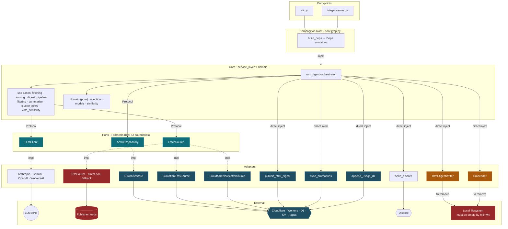
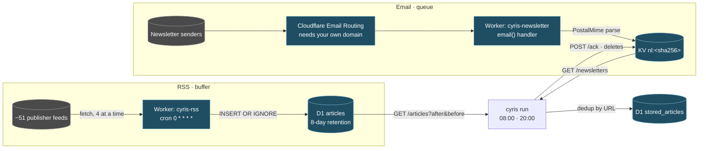

# Architecture

> Three questions this document answers: **who calls whom**, **how articles get in**, and
> **where each piece of data lives**. The last one is what breaks during a migration, and it had no
> written home here until 2026-08-27.
>
> Source of truth: `bootstrap.py` (who injects what), `service_layer/ports.py` (boundary
> contracts), `adapters/store/schema.sql` (what D1 holds), `workers/*/src/index.js` (ingestion).
>
> **This document drives the work.** Everything still to be built is listed in
> [§7 Not built yet](#7-not-built-yet), with its ticket. A destination named anywhere else in this
> document must appear there too — if it doesn't, the list is stale, not the plan.

## 1. Layers

```
entrypoints  →  service_layer  →  domain
                     ↑
                  adapters   (implement the service layer's Protocols)
```

`bootstrap.build_deps()` is the only place the three meet. The core (`service_layer` + `domain`)
imports nothing from `adapters` — it names Protocols, and the composition root supplies bodies.

Pipeline: **Fetch → Store → Score → Process → Output**, orchestrated end to end by
`service_layer/run_digest.py`. The CLI parses arguments and calls it; it holds no logic of its own.

## 2. Wiring



**Legend**: 🟢 Protocol boundary　🟠 still writes local files, must move　🔴 must not exist in the
target architecture　🔵 already on Cloudflare

### No Obsidian writer — deleted 2026-08-27 (M1)

`DigestWriter` — the Obsidian markdown note — is **gone**. The digest's output is the HTML digest on
Cloudflare Pages, plus the article store in D1. A reader who wants the digest in Obsidian exports it
themselves from either.

It took its whole dependency cone with it: `adapters/output/digest.py`, `adapters/output/
article_export.py`, `cyris.toml [obsidian]`, the `CYRIS_VAULT_PATH` environment variable, the vault
bind mount in `docker-compose.yml`, `cyris articles export`, and the vault export that ran on a
triage accept. `--dry-run` renders the HTML instead.

### Local filesystem is a defect, not a tier

A cloud system has no local disk. Three edges still touch one, and each has a destination:

| Edge | What it writes | Destination |
|---|---|---|
| `HtmlDigestWriter → FS` | digest + raw pages, then `wrangler pages deploy` | **R2** |
| `Embedder → FS` | `embeddings.json` (322 MB), rewritten whole every run | **Vectorize** |
| `NewsletterArchiveSource ← FS` | local maildir, superseded by the newsletter Worker | **deleted** |

**`cloud-p3` is done exactly when the `Local filesystem` node disappears from the diagram above.**
That is the acceptance test; anything else is progress reporting.

### Two wiring strengths

| Wiring | Targets | Swap difficulty |
|---|---|---|
| **Via Protocol** (`ports.py`) | `LLMClient`, `ArticleRepository`, `FetchSource` | **Low** — swapping the implementation never touches the core |
| **Direct injection** (no Protocol) | `HtmlDigestWriter`, `publish`, `sync_promotions`, `append_usage`, `notify`, embedder | **Medium** — the core calls them directly; a second backend needs a Protocol first |

`ports.py`'s rule: *only genuine IO boundaries get a Protocol; single-implementation components are
injected directly.*

One constraint shapes the store: **`ArticleRepository` is synchronous.** `run_digest` never awaits
it, so `D1ArticleStore` uses a blocking HTTP client. Making it async would push `async` through
`service_layer/`, which the cloud migration explicitly promised not to touch.

## 3. How a digest is made

### 3.1 Two ingestion paths



**RSS — a buffer, read idempotently.** `workers/rss` polls every feed on the hour, four at a time
(ten at once drew HTTP 429s from Substack). Entries older than the 8-day retention window are
dropped *before* the write — blogs ship months of history in their feed, and inserting then pruning
them burned ~1.5k writes per tick against D1's daily quota. Writes are `INSERT OR IGNORE`, so
re-seeing an entry every hour is free. `cyris` reads a time window with
`GET /articles?after=&before=`; **there is no ack**, so a crashed digest simply reads the window
again.

The buffer exists because a digest-time poll only sees each feed's current snapshot — 2–4 hours for
a busy feed, not 24. Measured: a digest-time poll missed 141 of 317 articles. `RssSource` (direct
polling) remains as the no-Worker fallback and is correct only for slow feeds.

**Email — a queue, drained with an ack.** Cloudflare Email Routing delivers to the `email()` handler
in `workers/newsletter`, which parses the message with PostalMime and stores
`{from, subject, html, text, date}` in KV under `nl:<sha256(from|subject|date)>` — so a re-delivered
copy overwrites instead of duplicating. `cyris` pulls with `GET /newsletters`, matches each sender
to a source via that source's `email_match`, and then `POST /ack` **deletes** what it processed.
Unmatched senders and private replies are ACKed without ingesting, so they cannot pile up.

| | RSS | Email |
|---|---|---|
| Shape | buffer | queue |
| Read | idempotent time window | pull + ack |
| Crash mid-run | reread, nothing lost | loses at most the current batch |
| Retention | 8 days, pruned by the Worker | until ACKed |
| Needs your own domain | no | **yes** — Email Routing cannot run on `*.workers.dev` |

Each newsletter issue also needs a canonical article link. That extraction is structural, not a
hostname allowlist, and has its own rule set — see
[the newsletter link section in CLAUDE.md](../CLAUDE.md) before touching
`adapters/fetch/newsletter.py`.

### 3.2 From articles to a digest

`fetch_all_articles` merges every `FetchSource`, **deduplicating by URL — last source wins**. A
source that throws is logged and skipped; the run continues degraded rather than failing.

Everything then goes to the store, and the store's `url` PRIMARY KEY is the second dedup: an article
seen in a previous window is not processed again.

Each source carries a **tier**, which decides how much attention it gets:

| Tier | Treatment |
|---|---|
| `filter` | Batched headline extraction, aggressively discarded (<10% pass). News-tagged articles are additionally clustered by topic. |
| `summarize` | Scored by the LLM, then split by `[routing] summarize_score_threshold` into full summaries and brief mentions. |
| `fan` | Passthrough. Never scored, filtered, or summarized — followed groups and newsletters go straight through. |

Between scoring and the pipeline one optional filter runs. **Vote similarity** suppresses candidates
sitting close to a downvoted article — it runs over *every* candidate, not just scored ones, because
the scorer skips news and the first downvote was news-tagged. It is the only personalization in the
pipeline: prompt-level preference learning was removed on 2026-08-27 because it had never produced a
profile.

Output is the HTML digest and a companion raw page listing everything the window collected —
uncapped and unfiltered, so what the digest dropped stays visible — both deployed to Cloudflare
Pages, followed by a Discord notification. Votes cast on the published digest go to the promote
Worker's KV and are drained hourly by `cyris promote-sync`, which is what turns a click into a
`triaged_at` stamp.

## 4. Data residency

Every persistent datum, where it lives now, and where it is going.

| Datum | Today | Destination | Notes |
|---|---|---|---|
| Article store | **D1 `stored_articles`** | same | `url` PRIMARY KEY is the dedup key |
| RSS buffer | **D1 `articles`** | same | Same database, different lifecycle: disposable, 8-day retention |
| Source definitions | **D1 `sources`** + `sources.yaml` fallback | same | Both cyris and `workers/rss` read it |
| LLM spend | **D1 `usage_log`** | same | `usage.jsonl` is its retired predecessor |
| Promote votes | **KV** (`workers/promote`) | same | Transient queue, drained hourly |
| Inbound newsletters | **KV** (`workers/newsletter`) | same | Transient queue, drained and ACKed per run |
| Embedding cache | `embeddings.json` **322 MB** + `embeddings-bge-m3.json` **93 MB** | **Vectorize** | Loaded into memory and rewritten whole every run |
| HTML digest + raw pages | `agent-vault/html/` | **R2** | `output_dir` is relative to cwd — hence the extra bind mount in compose |

The three D1 tables and the RSS buffer share one database (`cyris-rss`) on purpose: it is already
declared as a binding in `workers/rss/wrangler.toml`, which is what a Deploy to Cloudflare button
provisions from.

### One store, one truth

`ArticleStore` (JSON) and `D1ArticleStore` both satisfy `ArticleRepository`, and `[store] backend`
picks one. **They are alternatives, never a pair.** Running both — as happened between 2026-08-25
and 2026-08-27, when the container ran a stale image — splits the article store in both directions,
and `store migrate`'s `INSERT OR IGNORE` cannot heal a two-way split: it adds missing rows but never
overwrites, so a human triage decision recorded on the losing side is lost unless restored by hand.
`cyris store diff` is what makes such a split visible; run it before and after any cutover.

## 5. Configuration: four grades

Every setting belongs to exactly one grade. Mixing them is what makes a deployment un-portable.

| Grade | Home | Changing it costs | Who sets it |
|---|---|---|---|
| **A · Baked defaults** | code | a release | nobody at runtime |
| **B · Deployment identity** | `wrangler.toml`, provisioned at deploy | a redeploy | the deploy flow |
| **C · Secrets** | environment / `.env` / Worker secrets | an env change | the operator, once |
| **D · Runtime-mutable** | **D1 `settings`** *(planned)* | a write, effective next run | the reader, in the UI |

### Every setting, graded

| Setting | Grade | Today | Target |
|---|---|---|---|
| Tier thresholds, batch sizes, model defaults | A | code | unchanged |
| KV namespace ids, D1 database id | B | `wrangler.toml` | unchanged — Cloudflare rewrites these at deploy |
| Pages project name | B | `cyris.toml [promote]` | `wrangler.toml` |
| Three Worker URLs (`promote` / `newsletter` / `rss`) | B | `cyris.toml` | derived at deploy, not hand-written |
| **Email Routing: domain + route** | **B** | Cloudflare dashboard, by hand | **stays manual** — needs your own domain; the one step a Deploy button cannot automate |
| LLM API keys, `CYRIS_*_TOKEN`, Discord webhook | C | `.env` | Worker secrets |
| **RSS + newsletter source list** | **D** | **D1 `sources`**, `sources.yaml` fallback | done — adding a feed is a write, not a rebuild |
| **`email_match` per source** | **D** | inside the same `sources` row | same — an email sender is source data, not deploy config |
| LLM provider + model | D | `cyris.toml [llm_provider]`, written by `/settings` | **D1 `settings`** |
| Digest times + timezone | D | `docker/crontab` | **D1 `settings`** |
| Score thresholds, digest caps, output language, style prompt | D | `cyris.toml` | **D1 `settings`** |
| ~~`[obsidian]` vault path, `CYRIS_VAULT_PATH`~~ | — | — | **deleted** 2026-08-27 with `DigestWriter` |
| ~~`EmailConfig` — legacy local webhook~~ | — | — | **deleted** 2026-08-27, superseded by the newsletter Worker |

Two consequences of grade D being homeless today:

- `POST /api/settings` writes `cyris.toml` via `config.write_llm_provider`, but that file is baked
  into the image and mounted `:ro` in the container — **the settings page cannot work in the cloud
  as written.** Tracked in `schedule-settings-d1`.
- The digest schedule has two expressions: `docker/crontab` — the only one in force — and
  `cyris.toml [general] digest_schedule`, which nothing reads since launchd was deleted. **M2 adds
  the D1 row and makes it the effective one, with the file key as its fallback; the crontab becomes
  a fixed hourly tick that asks D1 whether this is a digest hour.**

Credentials never live in `cyris.toml`. Each config model injects its own from the environment in a
`model_validator`, so what the settings page reports as *configured* is what a run would actually
find.

## 6. Deployment, and how it fails

```
Cloudflare                                    Mac mini · docker compose
├── Worker: rss        → D1 articles          ┌────────────────────────┐
├── Worker: newsletter → KV                   │ supercronic            │
├── Worker: promote    → KV                   │   08:00  digest        │
├── D1: stored_articles · usage_log · sources │   20:00  digest        │
└── Pages: cyris-digest                       │   hourly promote-sync  │
                                              └────────────────────────┘
```

`cloud-p3` moves the right-hand box into a Cloudflare Container fronted by a Worker; `cloud-p4`
makes the whole thing deployable by someone else with one button.

**Known failure mode.** Code is baked into the image; config is bind-mounted. The two can drift
arbitrarily and nothing errors: on 2026-08-27 the container read `backend = "d1"` from a current
`cyris.toml` while running an image whose code had no `[store]` handling at all, so the setting was
silently ignored for two days.

- Changing code means `up -d --build --force-recreate`. Plain `up -d` is not enough.
- Changing `cyris.toml` or `sources.yaml` also means `--force-recreate`: single-file bind mounts
  bind an inode, and editors replace files by rename.
- **Verifying on the host is not verifying production.** An acceptance criterion signed off from a
  host run says nothing about what the container is running.
- `cyris doctor` should report what *this build* supports, not only what the config asks for —
  otherwise it goes green inside a container that is quietly ignoring half the file.

## 7. Not built yet

Everything this document describes as a *destination* rather than a *fact*, in one place. Anything
not on this list is already true of the running system.

### 7.0 The path

Seven milestones. Each one ends with a receipt — an observed effect, not an exit code. Only three
orderings are load-bearing; everything else can run in parallel.

```
M0 ─┬─ M1 ── M2 ─────────┐
    │                     ├─ M5 ── M6
    ├─ M3 ────────────────┤
    └─ M4 ────────────────┘

hard edges:  M0 → delete the JSON store      M2 → M5      (M3 + M4) → M5
```

| M | What | Why here | Receipt | Ticket |
|---|---|---|---|---|
| **M0** | Finish the D1 cutover | In flight | D1 `usage_log` gains a row from a container run **and** `agent-vault/usage.jsonl` stops growing. Then delete `agent-vault/articles/` | `cloud-p2` |
| **M1** | **Delete before porting** — `DigestWriter` + `[obsidian]` + `CYRIS_VAULT_PATH` + vault mount, `NewsletterArchiveSource` + maildir, `EmailConfig` + `webhook_server` + `cyris email-server`, `schedule/launchd.py` + `[general] digest_schedule`, `events/`, parity logs. Plus: make `cyris doctor` report what *this build* supports | Every deleted thing is one less thing to port, one less row in §4, and one less config key to grade. Cheapest work in the plan | Full `cyris run` still produces the HTML digest; `git grep -l 'DigestWriter\|NewsletterArchiveSource\|EmailConfig\|launchd'` returns nothing | new |
| **M2** | **Settings into D1** — a `settings` key/value table; `/settings` writes it instead of `cyris.toml`; grade-D keys read **D1 first, file as fallback** | **Hard prerequisite for M5.** In the container `cyris.toml` is baked into the image and mounted `:ro`, so a settings page that writes the file cannot work there. The read order matters just as much: without "D1 first, file fallback", a host run and a container run see different settings — the exact shape of the 08-25→08-27 split | Change the provider in the UI; the next run uses it with `cyris.toml` untouched | `schedule-settings-d1` |
| **M3** | HTML digest + raw pages → **R2**; publish → **Pages REST API** | Parallel with M2/M4. Must land before M5: a Container has no persistent disk | A digest run writes no file under `agent-vault/` and the Pages URL still returns 200 | `cloud-p3` |
| **M4** | Embeddings → **Workers AI `bge-m3` + Vectorize** | Parallel with M2/M3. Same reason as M3 — 415 MB of local JSON cannot follow the pipeline into a Container | `embeddings.json` deleted; `cyris vote-sim` at ≈0.53 suppresses the same set it does today | `cloud-p3` · `evaluate-embedding-provider` |
| **M5** | **Into the Container** — Worker-fronted Container; triage UI + `/settings` served through it **behind real auth**; supercronic → Workers Cron `0 * * * *` gated on the D1 schedule row; `onActivityExpired` → `stop()` | Everything local is gone by now, so this is a move rather than a rewrite | Mac mini off for 24 h and two digests appear; the triage UI is reachable **and an unauthenticated request is refused**; the bill shows the instance sleeping | `cloud-p3` |
| **M6** | **One-button deploy** — `deploy.json`, the README button, the secret checklist, Worker URLs derived at deploy, and the three-Workers-vs-one decision | Only meaningful once nothing runs locally | A clean Cloudflare account: press the button, fill the secrets, get a digest — with no code edits | `cloud-p4` |

Two things this table deliberately makes explicit:

- **The settings page is part of the cloud move, not a nicety.** It is a write surface that will be
  reachable from the public internet, and today it writes a file that will be read-only. That makes
  it M2 (its storage) and M5 (its auth) — never an afterthought.
- **M1 comes before every port.** Eliminate, then simplify, then move. Porting something that should
  have been deleted costs twice.

### Blocking the cloud move

| # | What | Today | Target | Ticket |
|---|---|---|---|---|
| 1 | HTML digest + raw pages | written to `agent-vault/html/` | **R2** | `cloud-p3` |
| 2 | Publishing | `wrangler pages deploy` via shell-out | **Pages REST API** — a Worker-fronted container cannot shell out | `cloud-p3` |
| 3 | Embeddings | `embeddings.json`, 322 MB, rewritten whole per run | **Workers AI `bge-m3` + Vectorize** (threshold ≈0.53, already measured) | `cloud-p3` · `evaluate-embedding-provider` |
| 7 | Scheduling | `docker/crontab` + supercronic, fixed 08:00/20:00 | **Workers Cron Trigger** (fixed hourly, gated on D1) | `cloud-p3` · `schedule-settings-d1` |
| 8 | `onActivityExpired` → `stop()` | not implemented | **required, not an optimisation**: default 10-min idle costs ~10 container-hours per 60 runs | `cloud-p3` |

### Blocking one-button deploy

| # | What | Today | Target | Ticket |
|---|---|---|---|---|
| 9 | Three Worker URLs + Pages project name | hand-written in `cyris.toml` | **derived at deploy** | `cloud-p4` |
| 10 | `deploy.json`, the README button, the secret checklist | absent | present | `cloud-p4` |
| 11 | Three Workers vs one button | undecided | decide **after** `cloud-p3`, with the Container as the primary | `cloud-p4` |

### Grade D has no home

| # | What | Today | Target | Ticket |
|---|---|---|---|---|
| 12 | D1 `settings` table | does not exist | **exists**; `/settings` writes it instead of `cyris.toml` | `schedule-settings-d1` |
| 13 | Digest times + timezone in the UI | `docker/crontab` only | a D1 row, effective next run | `schedule-settings-d1` |

### Unticketed — found while writing this document

| # | What | Why it matters |
|---|---|---|
| 14 | `cyris doctor` reports what the *config* asks for, not what *this build* supports | It went green inside a container that was ignoring `[store]` entirely. A capability check would have caught the 2026-08-25→27 split on day one |
| 17 | Retire the local JSON store | Pending tonight's receipt: D1 `usage_log` gains a row and `usage.jsonl` stops growing. Until then `store diff` reports `differing: 2` **by design** |

## 8. Where the core never changes

Across local, container, and cloud, `service_layer/` and `domain/` are untouched. Every difference
lives in `adapters/` and in `bootstrap.build_deps()`. That is the payoff of the Protocol +
composition-root design, and the reason the D1 store landed without a single line changing in the
pipeline.
