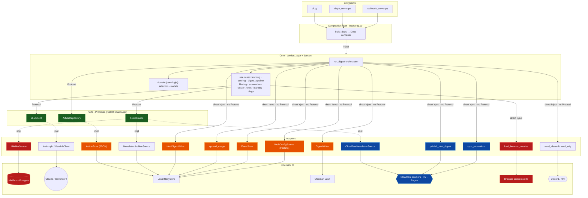

# Architecture: Core ↔ Adapter Wiring

> Drawn for the dockerize / cloud decision. Highlights which boundaries have a Protocol
> (clean to swap) and which are direct injections (need work to move to the cloud).
> Source of truth: `bootstrap.py` (who injects what) + `service_layer/ports.py` (boundary contracts).

## Wiring diagram

**Legend**: 🟢 Protocol boundary (clean to swap)　🟠 directly-injected local-file sink (needs work to move to the cloud, no Protocol)　🔴 local/macOS-bound　🔵 already cloud

## Key: two wiring strengths

`bootstrap.build_deps()` packs every adapter into the `Deps` container and injects it into
the core. But the core consumes them at **two strengths**:

| Wiring | Targets | Swap difficulty |
|--------|---------|-----------------|
| **Via Protocol** (`ports.py`) | `LLMClient`, `ArticleRepository` (ArticleStore satisfies it structurally), `FetchSource` | **Low** — swapping the implementation doesn't touch the core; the contract is fixed |
| **Direct concrete injection** (no Protocol) | DigestWriter, HtmlDigestWriter, publish, sync_promotions, EventStore, tracking, append_usage, cookies, notify | **Medium** — the core calls them directly; swapping the backend first needs a Protocol or an implementation change |

The `ports.py` comment states the design intent: "Only genuine IO boundaries get a Protocol;
single-implementation components are injected directly." These sinks currently have a single
implementation, so no Protocol was extracted. When the cloud move needs a second implementation
(R2/D1), this is the first boundary to add.

## Dockerize / cloud swap-point map

| Component | Current | Dockerize (local) | Cloud (Cloudflare) |
|-----------|---------|-------------------|--------------------|
| ArticleStore 🟠 | JSON @ local | volume mount, unchanged | extract Protocol → R2/D1 impl |
| EventStore / usage / tracking 🟠 | files | volume mount, unchanged | same, swap to R2/D1 |
| DigestWriter 🟠 | writes Obsidian vault | vault volume mount | disable (use HtmlDigestWriter → R2/Pages) |
| LLMClient 🟢 | Anthropic/Gemini | unchanged | unchanged (already cloud) |
| FetchSource · Miniflux 🔴 | self-hosted Docker | already in compose | retire, cyris fetches RSS itself |
| FetchSource · CloudflareNewsletter 🔵 | Worker+KV | unchanged | unchanged |
| load_cookies 🔴 | reads browser sqlite | mount host cookies (deferred) | loses auto-freshness (deferred) |
| publish / sync_promotions 🔵 | Cloudflare | unchanged | unchanged |
| Scheduling | launchd | cron | Workers Cron Trigger |

**Conclusion**: the core (`service_layer` + `domain`) **never changes** across all three
deployments. Every change is confined to the adapter layer — that is the payoff of the
Protocol + composition-root design. Dockerize needs only volume mounts (🟠 all stay put);
only the cloud move needs to extract Protocols for 🟠 and swap to R2/D1.
