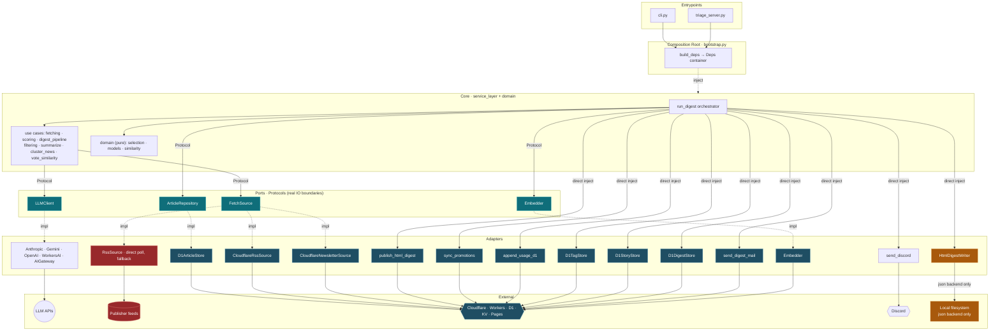
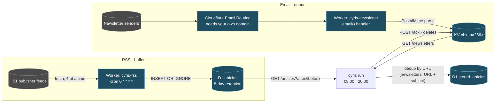

# Architecture

> Three questions this document answers: **who calls whom**, **how articles get in**, and
> **where each piece of data lives**. The last one is what breaks during a migration, and it had no
> written home here until 2026-08-27.
>
> Source of truth: `bootstrap.py` (who injects what), `service_layer/ports.py` (boundary
> contracts), `adapters/store/schema.sql` (what D1 holds), `workers/*/src/index.js` (ingestion).
>
> This document describes the system as it is. Open work is tracked outside this repository, and
> why each hard-to-reverse choice was made is in [`docs/decisions/`](decisions/).
> [§7](#7-architecture-changes) records each change to the architecture, with its commit on main.

## 1. Layers

```
entrypoints  →  service_layer  →  domain
     ↓               ↑
diagnostics       adapters   (implement the service layer's Protocols)
```

`bootstrap.build_deps()` is the only place the three meet. The core (`service_layer` + `domain`)
imports nothing from `adapters` — it names Protocols, and the composition root supplies bodies.

`diagnostics/` is off the pipeline entirely: `doctor` asks whether this deployment works, `compare` runs one window through two wirings and reports where they differ. It may import everything below it and nothing below it may import it, so deleting the
package would cost three commands and not one digest.

Pipeline: **Fetch → Store → Score → Process → Output**, orchestrated end to end by
`service_layer/run_digest.py`. The CLI parses arguments and calls it; it holds no logic of its own.

## 2. Wiring


```mermaid
flowchart TB
    subgraph EP["Entrypoints"]
        CLI["cli.py"]
        TRI["triage_server.py"]
    end

    subgraph ROOT["Composition Root · bootstrap.py"]
        DEPS["build_deps → Deps container"]
    end

    subgraph CORE["Core · service_layer + domain"]
        RUN["run_digest orchestrator"]
        UC["use cases: fetching · scoring · digest_pipeline<br/>filtering · summarize · cluster_news · vote_similarity"]
        DOM["domain (pure): selection · models · similarity"]
        RUN --> UC
        RUN --> DOM
    end

    subgraph PORTS["Ports · Protocols (real IO boundaries)"]
        P1["LLMClient"]
        P2["ArticleRepository"]
        P3["FetchSource"]
        P4["Embedder"]
    end

    subgraph ADP["Adapters"]
        LLM["Anthropic · Gemini · OpenAI · WorkersAI · AIGateway"]
        STORE["D1ArticleStore"]
        CFRSS["CloudflareRssSource"]
        CFNL["CloudflareNewsletterSource"]
        RSS["RssSource · direct poll, fallback"]
        HTML["HtmlDigestWriter"]
        PUB["publish_html_digest"]
        SYNC["sync_promotions"]
        USAGE["append_usage_d1"]
        NOTI["send_discord"]
        MAIL["send_digest_mail"]
        EMB["Embedder"]
        TAGS["D1TagStore"]
        STORIES["D1StoryStore"]
        DIGESTS["D1DigestStore"]
    end

    subgraph EXT["External"]
        API(("LLM APIs"))
        FEEDS[("Publisher feeds")]
        CFW{{"Cloudflare · Workers · D1 · KV · Pages"}}
        DISC{{"Discord"}}
        FS["Local filesystem<br/>json backend only"]
    end

    CLI --> DEPS
    TRI --> DEPS
    DEPS -. inject .-> CORE

    UC -->|Protocol| P3
    UC -->|Protocol| P1
    RUN -->|Protocol| P2
    RUN -->|Protocol| P4

    P1 -. impl .-> LLM
    P2 -. impl .-> STORE
    P3 -. impl .-> CFRSS
    P3 -. impl .-> CFNL
    P3 -. impl .-> RSS
    P4 -. impl .-> EMB

    RUN -->|direct inject| HTML
    RUN -->|direct inject| PUB
    RUN -->|direct inject| SYNC
    RUN -->|direct inject| USAGE
    RUN -->|direct inject| NOTI
    RUN -->|direct inject| MAIL
    RUN -->|direct inject| TAGS
    RUN -->|direct inject| STORIES
    RUN -->|direct inject| DIGESTS

    LLM --> API
    STORE --> CFW
    CFRSS --> CFW
    CFNL --> CFW
    RSS --> FEEDS
    PUB --> CFW
    SYNC --> CFW
    USAGE --> CFW
    TAGS --> CFW
    STORIES --> CFW
    DIGESTS --> CFW
    NOTI --> DISC
    MAIL --> CFW
    EMB --> CFW
    HTML -->|json backend only| FS

    classDef port fill:#0F6E7A,stroke:#5AC3CC,color:#fff;
    classDef fallback fill:#A8590C,stroke:#DFA45E,color:#fff;
    classDef bad fill:#98292B,stroke:#E28079,color:#fff;
    classDef cloud fill:#1F4E63,stroke:#7FB6CC,color:#fff;
    class P1,P2,P3,P4 port;
    class HTML,FS fallback;
    class RSS,FEEDS bad;
    class CFNL,CFRSS,PUB,SYNC,CFW,STORE,USAGE,TAGS,STORIES,DIGESTS,EMB,MAIL cloud;
```

**Legend**: 🟢 Protocol boundary　🟠 the `json` backend's fallback path　🔴 must not exist in the
target architecture　🔵 already on Cloudflare

### No Obsidian writer — deleted 2026-08-27 (M1)

`DigestWriter` — the Obsidian markdown note — is **gone**. The digest's output is the HTML digest on
Cloudflare Pages, plus the article store in D1. A reader who wants the digest in Obsidian exports it
themselves from either.

It took its whole dependency cone with it: `adapters/output/digest.py`, `adapters/output/
article_export.py`, `cyris.toml [obsidian]`, the `CYRIS_VAULT_PATH` environment variable, the vault
bind mount in `docker-compose.yml`, `cyris articles export`, and the vault export that ran on a
triage accept. `--dry-run` renders the HTML instead.

### Local filesystem is a defect, not a tier

A cloud system has no local disk. Three edges once touched one; all three are closed, and none
closed by moving to the storage product first named for it:

| Edge | What it wrote | How it closed |
|---|---|---|
| `HtmlDigestWriter → FS` | digest + raw pages, then `wrangler pages deploy` | **not R2.** Pages Direct Upload over REST (`adapters/output/pages_deploy.py`); with D1 the pages are rendered in memory and never reach a disk — why not R2: [ADR-0004](decisions/0004-publish-over-pages-rest-without-r2.md) |
| `Embedder → FS` | `embeddings.json` (415 MB), rewritten whole every run | **not Vectorize.** The cache was deleted rather than relocated — a run re-embeds ~600 texts for ~20 neurons — why not Vectorize: [ADR-0005](decisions/0005-no-vector-index-and-no-embedding-cache.md) |
| `NewsletterArchiveSource ← FS` | local maildir | **deleted** 2026-08-27 (M1), superseded by the newsletter Worker |

One filesystem edge remains, and it is the documented fallback rather than a defect:
`HtmlDigestWriter` writes `agent-vault/html/` when `[store] backend` is still `json`. With D1 wired,
the site's file list comes from the `pages_manifest` table and nothing is written locally.

**The Container move was done when the `Local filesystem` node left the D1 path.** That was the acceptance
test.

### Two wiring strengths

| Wiring | Targets | Swap difficulty |
|---|---|---|
| **Via Protocol** (`ports.py`) | `LLMClient`, `ArticleRepository`, `FetchSource`, `Embedder` | **Low** — swapping the implementation never touches the core |
| **Direct injection** (no Protocol) | `HtmlDigestWriter`, `publish`, `sync_promotions`, `append_usage`, `notify`, `send_email`, `send_email_alert`, `D1TagStore`, `D1StoryStore`, `D1DigestStore` | **Medium** — the core calls them directly; a second backend needs a Protocol first |

`ports.py`'s rule: *only genuine IO boundaries get a Protocol; single-implementation components are
injected directly.*

**Spend is part of both provider ports, in each one's own shape.** `llm-compare` and `embed-compare`
exist to answer "which provider costs less", so the number they read cannot be an undeclared
attribute a second implementation is free to omit. The two shapes stay separate because the
lifetimes differ: `LLMResponse.neurons` is what one call cost and `UsageStats.add` sums it, while
`Embedder.usage` (`ports.EmbeddingUsage`) accumulates across the batches one `embed` run makes.
`None` is the answer for a provider that reports nothing — Gemini's `batchEmbedContents` returns
bare vectors, and `0.0` there would read as a measured cost of nothing.

### `diagnostics/` — the tools that inspect the deployment

`src/cyris/diagnostics/` holds the tools whose subject is the deployment rather than the digest:
`doctor`, which builds the real adapters itself and never calls `build_deps`; `embed-compare` and
`llm-compare` in `compare.py`, which build two wirings and return rows; and `config show` in
`config_show.py`. The CLI parses, prints and owns every local write. `tests/test_core_imports.py`
fails if `service_layer/` or `domain/` imports `cyris.adapters` or `cyris.bootstrap` at runtime,
and fails again if anything below `diagnostics/` imports it back. Why a layer of its own:
[ADR-0007](decisions/0007-diagnostics-is-its-own-layer.md).

One constraint shapes the store: **`ArticleRepository` is synchronous**, so `D1ArticleStore` uses a
blocking HTTP client ([ADR-0002](decisions/0002-article-repository-stays-synchronous.md)).

## 3. How a digest is made

### 3.1 Two ingestion paths


```mermaid
flowchart LR
    subgraph RSSPATH["RSS · buffer"]
        FEEDS[("~51 publisher feeds")]
        WRSS["Worker: cyris-rss<br/>cron 0 * * * *"]
        DB1[("D1 articles<br/>8-day retention")]
        FEEDS -->|"fetch, 4 at a time"| WRSS
        WRSS -->|INSERT OR IGNORE| DB1
    end

    subgraph MAILPATH["Email · queue"]
        SENDER[("Newsletter senders")]
        ROUTE["Cloudflare Email Routing<br/>needs your own domain"]
        WNL["Worker: cyris-newsletter<br/>email() handler"]
        KV[("KV nl:&lt;sha256&gt;")]
        SENDER --> ROUTE --> WNL
        WNL -->|PostalMime parse| KV
    end

    RUN["cyris run<br/>08:00 · 20:00"]
    DB1 -->|"GET /articles?after&before"| RUN
    KV -->|GET /newsletters| RUN
    RUN -->|POST /ack · deletes| KV

    STORE[("D1 stored_articles")]
    RUN -->|"dedup by URL (newsletters: URL + subject)"| STORE

    classDef cloud fill:#1F4E63,stroke:#7FB6CC,color:#fff;
    classDef ext fill:#4A4A4A,stroke:#9E9E9E,color:#fff;
    class WRSS,DB1,WNL,KV,ROUTE,STORE cloud;
    class FEEDS,SENDER ext;
```

**RSS — a buffer, read idempotently.** `workers/rss` polls every feed on the hour, four at a time
(ten at once drew HTTP 429s from Substack). Entries their feed dates more than 8 days back are
dropped *before* the write — blogs ship months of history in their feed, and because the read goes
by buffer entry, that history would otherwise reach the next digest as new. Writes are
`INSERT OR IGNORE`, so re-seeing an entry every hour is free. `cyris` reads a time window with
`GET /articles?after=&before=`, which selects by when an entry *entered the buffer*, not by the date
its feed gave it, so an entry a feed lists late still reaches the next run. That holds while each
run's window reaches back past the previous run by more than one poll's duration: a poll stamps its
rows when it starts, so a row can land after a run has already read past its stamp. `RssSource`
stays on publish time. **There is no ack**, so a crashed digest simply reads the window again.
Each poll also upserts every polled feed's outcome into `feed_health` (§4), after the articles and
never at their expense: a feed that keeps failing used to be a `console.warn` per hour, gone with
Workers Logs after 7 days, and on 2026-09-28 one had stored no article ever behind an hourly HTTP 503.

Why a buffer rather than a poll at digest time, and why it has no ack:
[ADR-0001](decisions/0001-rss-arrives-through-an-hourly-buffer.md). `RssSource` (direct polling)
remains as the no-Worker fallback and is correct only for slow feeds.

**Email — a queue, drained with an ack.** Cloudflare Email Routing delivers to the `email()` handler
in `workers/newsletter`, which parses the message with PostalMime and stores
`{from, subject, html, text, date}` in KV under `nl:<sha256(from|subject|date)>` — so a re-delivered
copy overwrites instead of duplicating. `cyris` pulls with `GET /newsletters`, matches each sender
to a source via that source's `email_match`, and then `POST /ack` **deletes** what it processed.
Unmatched senders and private replies are ACKed without ingesting, so they cannot pile up.

**A preview must not drain a queue.** Because this edge and the vote sync consume rather than
read, `--dry-run` is decided in `bootstrap.build_deps`, not inside `run_digest`: the preview gets
a newsletter source constructed with `ack=False` and no `sync_promotions` at all. Until
2026-09-06 it got neither, so a preview against production deleted the issues it had just
declined to store, and stamped vote verdicts on their way to draining the vote queue. Skipping
the writes downstream does not undo an upstream delete — a source that takes has to be wired
differently, which is why the decision lives at the composition root.

| | RSS | Email |
|---|---|---|
| Shape | buffer | queue |
| Read | idempotent time window | pull + ack |
| Crash mid-run | reread, nothing lost | loses at most the current batch |
| Retention | 8 days from buffer entry, pruned by the Worker | until ACKed |
| Needs your own domain | no | **yes** — Email Routing cannot run on `*.workers.dev` |

Each newsletter issue also needs a canonical article link. That extraction is structural, not a
hostname allowlist, and has its own rule set — see
[the newsletter link section in CLAUDE.md](../CLAUDE.md) before touching
`adapters/fetch/newsletter.py`.

### 3.2 From articles to a digest

`fetch_all_articles` merges every `FetchSource`, **deduplicating by URL — last source wins**,
except that two newsletter issues with different ids sharing one URL are both kept. A source that
throws is logged and skipped; the run continues degraded rather than failing.

Everything then goes to the store, and the store's `url` PRIMARY KEY is the second dedup: an article
seen in a previous window is not processed again. A newsletter issue is deduplicated by URL plus
subject, realised without changing the key (`adapters/store/newsletter_dedup.py`): when its URL is
already held by an issue of the same source with a different subject — a sender's repeated nav link
— it is stored under its synthetic `newsletter:{id}` URL and loses that link. Same URL and same
subject is a re-delivery and is skipped. The extractor's `Article.url` may repeat across issues; the
stored URL cannot.

The run cap, `[digest] max_articles_per_digest`, is applied once, at the pending load in
`run_digest`: a run scores and digests the window's newest N pending articles by publish time,
across all sources. A capped run therefore cuts the oldest-published rows first; the tripwire is
`received + suppressed == max_articles_per_digest` in `digest_runs.summary`, a missing `suppressed`
counting as 0. No source applies it, because one that cut first would drop articles before the
store saw them. The RSS Worker read has a bound of its own, the Worker's row ceiling, because every
row carries the feed's full content and the Worker holds the whole result in memory. A read that
fills the ceiling logs a warning, since the window's earliest-buffered rows then stay unstored.

Each source carries a **tier**, which decides how much attention it gets:

| Tier | Treatment |
|---|---|
| `filter` | Batched headline extraction, aggressively discarded. News-tagged articles are additionally clustered by topic. |
| `summarize` | Scored by the LLM, then split by `[routing] summarize_score_threshold` into full summaries and brief mentions. The summarized ones become the Top story and Features (below). |
| `fan` | Passthrough. Never scored, filtered, or summarized — followed groups and newsletters go straight through. |

Between scoring and the pipeline one optional filter runs. **Vote similarity** suppresses candidates
sitting close to a downvoted article — it runs over *every* candidate, not just scored ones, because
the scorer skips news and the first downvote was news-tagged. It is the only personalization in the
pipeline, and it acts twice: here it suppresses, and with the vote order on its verdicts also order
the issue (below). Prompt-level preference learning was removed on 2026-08-27 because it had never
produced a profile. On D1, every candidate it judged also leaves a row in `vote_similarity_shadow` naming its
nearest upvoted and downvoted article and both cosines (§4), a record that changes nothing the run
selects.

The summarize call writes a summary for each group and one for each article. `layer_by_score`
then lays them out inside `DigestPipeline`, before the issue's article cap: the Top story is a
group only when two or more of its articles reach `[routing] score_threshold`, and then it
carries every article of that group, since the group summary covers them all. Every other
article is one Features card under its own summary, highest score first, at most
`[digest] max_featured` of them. An article past either limit is left out of the issue and stays
pending. The cap takes the Top story whole, or its best article in its slot, before anything else.

**The vote order** (`[digest] rank_by_preference`). When it is on and vote similarity judged this
run's candidates, a candidate's preference is its cosine to the nearest upvote minus its cosine to
the nearest downvote, a side with no seed counting 0. `select_digest_articles` orders by it before
the issue cap: the Features after their score sort, and the headlines, which otherwise keep the
model's order. The cap then cuts as before, so of two headlines competing for the last slot the one
closer to an upvote is shown. An item of several articles takes its best article's preference,
equal preferences keep the incoming order, and an item with none keeps its slot. The Top story
never moves, and which Features `max_featured` keeps is still the score's choice. The order rejects
nothing and stamps no `triaged_at`: what it changes is which article the cap shows, accepted, and
which it cuts, left pending. Off, or with vote similarity off or skipped, the issue keeps the
model's order. `run_summary` records which: `preference_rank_applied`, the reason in
`preference_rank_skipped`, and `preference_rank_moved_headlines` and `_features`, the positions
that differ from the order without it.

Two analytics facts are persisted beside the digest, both fail-soft — a write failure is logged
and the run continues. Topic tags emitted by scoring and by news clustering land normalized in D1
`tags`/`article_tags` (`D1TagStore`), and each run's pre-truncation story membership — which
articles the clustering step grouped, including members the output cap dropped — replaces its
(date, period) window in `stories`/`story_members` (`D1StoryStore`). Both stores are direct
injections built only when D1 is configured; with `backend = "json"` they are absent and the run
skips the writes.

Output is the HTML digest and a companion raw page listing what this run judged plus whatever is
still pending — uncapped, so what the digest dropped stays visible; rows an earlier run in the
overlapping 24h window already judged are left off, since they were on that run's raw page — both
deployed to Cloudflare
Pages, followed by a notification to Discord and, when a recipient is set, by mail. An issue
whose publish failed is not digested again: its articles are already accepted. Instead every
non-dry run starts by comparing D1 `digests` with `pages_manifest` and publishes each stored
issue the site lacks, re-rendered from its row, before anything can end the run early; the raw
page is not stored, so a republished issue links none. A run that
raises inside `run_digest`, or fetches nothing while a source failed, sends a failure alert to
the same channels after the run is recorded. It carries the error or the failed sources and the
time the run started. A scheduled run (`--if-due`) that stops before `run_digest`, on incomplete
settings or a `build_deps` that raises, sends `Digest run could not start` to the same channels,
on a digest hour only, since every hourly tick hits the same failure; it leaves no `digest_runs`
row. Settings that cannot name the schedule or a channel send nothing, and so do a D1 the
container cannot read and a container that never starts: those are left to Workers Logs. A dry
run, a run started by hand and a SIGTERM-cancelled run send no alert. Votes cast on the
published digest go to the promote Worker's KV and are drained at each digest run, by the run
itself and by the `cyris promote-sync` after it, which is what turns a click into a
`triaged_at` stamp. The stamp is the sync's time, not the click's: `sync_promotions` parses the
payload's `ts` and never stores it, so how often votes arrive cannot be read from the store. A
vote on a grouped item posts once for every URL in the group, so rows stamped at one instant may
be one judgment rather than independent labels. The raw page's triage view is the only triage surface; the pending backlog
across days is reachable only through `cyris articles`.

A run whose provider is not `none` but whose scoring, filter or summarize step went on without
the LLM's answer, because no client was built or its call failed, is *degraded*
(`is_degraded_run` in `domain/models.py`): the notification, the page and the mail open with a
notice saying so.

## 4. Data residency

Every persistent datum, where it lives now, and where it is going.

**What this table covers:** state the pipeline keeps — anything a later run or a
reader depends on. It does not cover a diagnostic command's output, and it does not need to: the
comparisons write nothing at all, they emit, and where that lands is the shell's decision.
`tests/test_local_writes.py` holds the set of files allowed to touch local disk at four, all of
them a backend the D1 path does not use. A new one fails that test before it can become a row
nobody added. `tests/test_residency_covers_schema.py` does the same for the other half: every
table `schema.sql` creates must appear in the rows below, so a new table cannot ship unlisted.

| Datum | Today | Destination | Notes |
|---|---|---|---|
| Article store | **D1 `stored_articles`** | same | `url` PRIMARY KEY is the dedup key; a colliding newsletter issue is re-keyed to `newsletter:{id}` |
| Tag vocabulary | **D1 `tags`** | same | Normalized tags emitted by clustering and scoring |
| Article tags | **D1 `article_tags`** | same | URL-keyed article membership in the tag vocabulary |
| Stories | **D1 `stories`** | same | Pre-truncation news clusters, keyed `{date}-{period}-{urlhash}` (content-derived from member URLs), replaced per window |
| Story membership | **D1 `story_members`** | same | URL-keyed article membership in each story |
| RSS buffer | **D1 `articles`** | same | Same database, different lifecycle: disposable, 8-day retention counted from buffer entry |
| Feed health | **D1 `feed_health`** | same | One row per RSS feed the Worker has polled: the current failure streak, the last error and when, and the last success. Written by `workers/rss` on every poll, read by `cyris doctor` and `/settings` together with the newest `stored_articles.first_seen_at` per source, which needs no state of its own; `cyris run` neither reads nor writes it. Both `schema.sql` and the Worker create it. A row for a retired source stays behind, harmless, since both readers start from `sources`. D1 only: a `json` deployment polls no Worker |
| Source definitions | **D1 `sources`**; `sources.yaml` for a `json` deployment | same | One home per backend. Both cyris and `workers/rss` read the table; an empty one stops `cyris run` and polls no feed |
| Runtime settings | **D1 `settings`**; `cyris.toml` for a `json` deployment | same | Grade D. One home per backend, no value in code, and a missing key stops the run — see §5 |
| Discord webhook | **D1 `settings`** | same | written by `/settings`; `""` means notifications are off. A `json` deployment keeps it in `cyris.toml [notify]` |
| Mail addresses (recipient, sender) | **D1 `settings`** | same | written by `/settings` after a test message reaches the recipient; an empty recipient means no mail. A `json` deployment keeps them in `cyris.toml [notify]` |
| LLM spend | **D1 `usage_log`** | same | `agent-vault/usage.jsonl` is the no-D1 fallback only, the same alternative the article store has: `build_deps` picks one or the other, never both |
| Promote votes | **KV** (`workers/promote`) | same | Transient queue, drained at each digest run |
| Inbound newsletters | **KV** (`workers/newsletter`) | same | Transient queue, drained and ACKed per run |
| Deployed site's file list | **D1 `pages_manifest`** | same | path → Pages asset hash, a few KB. The *bytes* are Cloudflare's, not ours |
| Digest runs | **D1 `digest_runs`** | same | One row per `run_digest` call on every path — `no_articles`, `no_pending`, `error` included — with status, period, dry-run flag, fetch counts, the image's `CYRIS_GIT_SHA`, the degraded judgement and the whole `run_summary` as JSON. Written after the log line, inside its own guard. D1 only: a `json` run writes nothing and keeps only stdout |
| Digest content | **D1 `digests`** | same | One row per issue, keyed `(date, period)`, last run wins: the final `DigestContent` as JSON plus `raw_page`, the flag saying whether that run's digest page linked a raw companion page — the two inputs the digest page renders from. The raw companion page itself is not reproducible from it. D1 only: a `json` run keeps no copy |
| Vote-similarity pool | **D1 `vote_similarity_shadow`** | same | One row per candidate a run judged against the reader's votes, keyed `(run_at, candidate_url)`: the nearest upvoted and downvoted article with each cosine, and the embedding model. `run_at` is the run's `started_at`, which `digest_runs.summary` also carries, and its `vote_similarity_judged` is the run's row count. Raw data with no verdict: the suppression decision and its threshold are not stored. Written by `run_digest` right after `judge_by_votes`, inside its own guard, from the cosines that call already computed, so it costs no embedding call; a run whose similarity pass skipped, and a dry run, write nothing. Nothing reads it yet. D1 only: a `json` run keeps no copy |
| Pages deploy receipt | **D1 `pages_deploy_receipt`** | same | this D1 has published this Pages project; empty-manifest guard skips the Cloudflare probe. It is not a shortcut around the live-archive shortfall check |
| ~~Embedding cache~~ | — | **nowhere** | Deleted 2026-08-27. Not moved: a full run is ~600 texts ≈ 20 neurons of a 10,000/day allowance, so the 415 MB existed to skip five seconds of arithmetic |
| Run log (one `run_summary` JSON line per run, plus everything the container prints) | **Workers Logs**, 7 days | same | Not a record, and not state: it is the operational window — what last night's run fetched, spent and did. The `run_summary` dict itself is no longer only here: its durable copy is `digest_runs.summary` (one row per run, D1 only). Everything else the container prints stays in this window, and a longer retention is still not the answer |
| HTML digest + raw pages | **published from memory** | same | `agent-vault/html/` is the no-D1 fallback only. The deployed site is the archive of the pages as published; a digest page can also be re-rendered from D1 `digests`, a raw page cannot |
| Marketing website (outside the pipeline) | **`website/` source + separate Pages project `cyris-site`**; the launch film in **R2 `musingfox-media`** under `cyris/` | same | Static M2 branding and landing page; no D1 manifest, user data, or connection to the digest publisher |

The article-store tables and the RSS buffer share one database (`cyris-rss`) on purpose
([ADR-0012](decisions/0012-the-app-deploys-from-the-repo-root.md)). A trial deployment (`scripts/trial-wizard.sh`, which renders its configs with
`scripts/provision_trial.py`; `docs/trial-deployment.md`) shares nothing: its rss Worker binds the
trial's own D1, the one its app uses, named like its app Worker. The wizard keeps a trial's inputs,
ids and progress in `.env.trial-<slug>-wizard` at the repo root, beside the trial's secrets files;
those secrets files are the only copy, since Cloudflare cannot read a secret back.

### One store, one truth

`ArticleStore` (JSON) and `D1ArticleStore` both satisfy `ArticleRepository`, and `[store] backend`
picks one. **They are alternatives, never a pair**
([ADR-0003](decisions/0003-one-home-per-backend.md)). `cyris store diff` is what makes a split
visible; run it before and after any cutover.

## 5. Configuration: four grades

Every setting belongs to exactly one grade. Mixing them is what makes a deployment un-portable.
What each of these choices costs to host — measured usage against the plan's allotments, the free
plan's ceilings, and the priced alternatives — is `docs/hosting-and-cost.md`.

| Grade | Home | Changing it costs | Who sets it |
|---|---|---|---|
| **A · Baked defaults** | code | a release | nobody at runtime |
| **B · Deployment identity** | `cyris.toml`; the environment (`CYRIS_<TABLE>_<KEY>`) fills a key the file leaves absent or empty | an env change or a redeploy | the deploy flow |
| **C · Secrets** | environment / `.env` / Worker secrets | an env change | the operator, once |
| **D · Runtime-mutable** | **D1 `settings`** (a `json` deployment: `cyris.toml`) | a write, effective next run (the type size: within a minute) | the reader, in the UI |

### Every setting, graded

| Setting | Grade | Today | Target |
|---|---|---|---|
| Batch sizes | A | `BATCH_SIZE` in `service_layer/scoring.py` and on each embedder in `adapters/embedding.py` | unchanged |
| RSS Worker read ceiling | A | `WORKER_ROW_CEILING` in `adapters/fetch/rss_worker_source.py`, mirroring the clamp on `GET /articles` in `workers/rss/src/index.js` | done 2026-10-02 — a memory bound, not the run cap: every row carries full feed content. It is sent by value because the Worker's default without one is lower; `tests/test_rss_worker_source.py` holds the two equal |
| Feed health thresholds: unhealthy at 3 consecutive failed polls, or no stored article for 30 days (never included) | A | `UNHEALTHY_FAILURE_STREAK`, `QUIET_DAYS` in `adapters/store/feed_health.py` | done 2026-10-08 — one Substack 429 is routine, three hourly polls failing in a row is not; feeds publish weekly or monthly, so a shorter silence is noise. `cyris doctor` and `/settings` both judge through `FeedHealth.problems`, so neither copies a number |
| Pages publish timing: the 180s budget and 120s run reserve, the stage and alias poll counts and intervals, the 20s per-request timeout and a deploy attempt's worst case | A | `adapters/output/publish.py`, `adapters/output/pages_deploy.py` | unchanged — reasons in the comments beside each constant; `tests/test_publish.py` pins the budget against `RUN_SLEEP_AFTER` in `workers/app/src/index.js`, and what the budget does not cover is in *Publishing* (§6) |
| `/settings` verification time limits: the LLM probe's 30s, the embedding probe's 15s, the Discord probe's 10s | A | `LLM_PROBE_TIMEOUT_SECONDS`, `EMBEDDING_PROBE_TIMEOUT_SECONDS`, `DISCORD_PROBE_TIMEOUT_SECONDS` in `diagnostics/doctor.py` | done 2026-10-02 — a Save is a person waiting, so each bound sits far below the minutes a run allows the same client; reasons in the comments beside the first two. A probe past its bound fails with what to do next, and nothing is stored |
| Vote request timeout on the digest and raw pages | A | `VOTE_TIMEOUT_MS` in `adapters/output/templates/_promote_script.html.j2` | done 2026-10-02 — reason in the comment beside it; a vote that outlasts it is shown to the reader as not landed |
| Per-provider default model, per-model embedding threshold | A | `src/cyris/provider_defaults.json` | unchanged — values in the file, reasons in *Provider defaults* below |
| Runtime-setting registry: each grade-D key's `/settings` category, label, controls, save route and whether a save applies live | A | `src/cyris/settings_fields.json` | unchanged — the one key list (see *Where grade D lives*); `tests/test_settings_fields.py` holds the page to it |
| `cyris config show` registry: the rows it lists beyond `settings_fields.json` and `B_GRADE_ENV_VARS`, and every label it prints | A | `src/cyris/diagnostics/config_show.json` | done 2026-10-08 — the image ships `src/` only, so `.env.example` cannot be read at runtime; `tests/test_deploy_inputs.py` holds the secret list to it, and each code constant is named as `module:attribute` so the value shown is the one the code runs with |
| Mail vocabulary: forward/reply subject prefixes, "view in browser" markers | A | `adapters/fetch/keywords.json`, loaded by `keywords.py` | unchanged — data so a new locale is not a code edit; the regex structure around the tokens stays in code |
| Project link and favicon on the rendered pages | A | `PROJECT_URL` and `FAVICON` in `adapters/output/html_digest.py` | done 2026-10-02 — the upstream project's site, not this deployment's: a fork's pages still credit where they came from, so neither a deployment nor a reader setting changes it. The favicon is a copy of `website/assets/favicon.svg`, because the image ships `src/` only; `tests/test_ui_spec.py` holds the two copies equal, and every publish deploys it, on the manifest path and the local-directory path alike |
| Image's build commit | A | `GIT_SHA` build arg, baked as `CYRIS_GIT_SHA` by the `Dockerfile` | unchanged — the release workflow supplies it; a local `docker build` legitimately leaves it empty |
| Container placement regions | A | `[containers.constraints] regions` in `wrangler.toml` (`WNAM`, `ENAM`) | unchanged — Gemini and OpenAI refuse by egress location, and unconstrained placement landed in one of theirs; `tests/test_deploy_inputs.py` keeps `APAC` out |
| Container image name | A | `[[containers]] name` in `wrangler.toml`, mirrored by `IMAGE_NAME` in both workflows | done 2026-09-21 — stated rather than derived. A trial config from `scripts/provision_trial.py` renames the container application while its image stays in the tracked repository, so the name differing there is not drift. Left unset, wrangler names the repository after the Worker plus the class (`cyris-app-cyriscontainer`) while the workflows said `cyris-app`, so a local `wrangler deploy` and a CI deploy pushed to two repositories and each pointed the one container application at an image the other had never written — a CI deploy after a local one serves the older code with a green log. `tests/test_deploy_inputs.py` holds all three names to one string |
| KV namespace ids, D1 database id | B | `wrangler.toml`; `CYRIS_STORE_DATABASE_ID` for the article store | done |
| Cloudflare account id, for CI | B | GitHub Actions repository **variable** `CLOUDFLARE_ACCOUNT_ID` | done — a variable, not a secret: it is deployer identity, and keeping it readable makes a wrong registry path a visible 404 rather than `***` |
| Deployment URL, for CI | B | GitHub Actions repository **variable** `CYRIS_DEPLOYMENT_URL` (the app Worker's `workers.dev` URL; the custom domain's Access would stop the check) | done 2026-09-26 — read by `deploy.yml`'s `verify` step only |
| Store backend | B | `CYRIS_STORE_BACKEND` (`json`/`d1`; a value set in the file wins) | done |
| Pages project name | B | `CYRIS_PROMOTE_PAGES_PROJECT` (a value set in `cyris.toml [promote]` wins) | done |
| Marketing Pages project + hostname | B | `website/wrangler.toml`; Pages custom domain / DNS; canonical and social URLs in `website/index.html` | done — separate from the digest project |
| HTML digest render / Pages publish | B | `CYRIS_HTML_OUTPUT_ENABLED`, `CYRIS_PROMOTE_PUBLISH_ENABLED` | done |
| Promote custom domain | B | `CYRIS_PROMOTE_CUSTOM_DOMAIN`, an override | done — the host of the digest link Discord receives. Unset, each run lists the app Worker's custom domains (`GET /accounts/{id}/workers/domains?service=`, Workers Scripts Read on `CLOUDFLARE_API_TOKEN`) and takes the first in sorted order, with or without Access. No domain, or a failed lookup, falls back to `pages.dev`, where `/api/vote` does not exist and no vote buttons render; the failure is logged and `cyris doctor` reports it |
| App Worker name, for the container | A | `[vars] CYRIS_APP_WORKER_NAME` in `wrangler.toml`, forwarded by `workers/app/src/index.js` | done 2026-09-27 — the `service` the domain lookup names; `tests/test_deploy_inputs.py` holds it equal to `name`. A trial config from `scripts/provision_trial.py` renames the Worker and this variable together |
| Three Worker URLs (`promote` / `newsletter` / `rss`) | B | `CYRIS_PROMOTE_WORKER_URL`, `CYRIS_NEWSLETTER_WORKER_URL`, `CYRIS_RSS_WORKER_URL` (a value set in the file wins) | done |
| UI Access hostname | B | `CYRIS_UI_ACCESS_HOST` (Worker-only; unset = cookie-only form) | done |
| Private archive | B | `CYRIS_PRIVATE_ARCHIVE` (Worker-only; `"true"` sends a reader without a session to `/login`; unset = public archive) | done 2026-10-05 — default off, so production's archive stays public; a trial deployment turns it on in its generated config |
| Digest archive origin | B | `DIGEST_ORIGIN` (Worker-only; Pages origin the Worker proxies). Optional since 2026-09-06: unset, it is `<CYRIS_PROMOTE_PAGES_PROJECT>.pages.dev`, so only a custom domain needs to say it twice | done |
| **Email Routing: domain + route** | **B** | Cloudflare dashboard, by hand | **stays manual** — needs your own domain; the one step a Deploy button cannot automate |
| LLM API keys, three Cloudflare tokens (D1 + Pages + Workers Scripts Read + Email Sending, embedding, Workers AI LLM — the last also the `ai_gateway` provider's), one Worker bearer, one vote token, the `/settings` login token (`CYRIS_UI_TOKEN`, read by the Worker only) | C (the vote token was rendered into every digest published before 2026-09-01; a deployment that published none has no such pages) | `.env` locally, **`cyris-app` Worker secrets in production**; `CLOUDFLARE_CONTAINERS_TOKEN` in GitHub Actions secrets | done — see below. `CLOUDFLARE_CONTAINERS_TOKEN` is instead a GitHub Actions secret for the CI release workflow; it never enters the container. `CYRIS_UI_TOKEN` is also a GitHub Actions secret, a copy that `deploy.yml`'s `verify` step alone reads to ask production which image it serves, so rotating it means replacing both |
| RSS + newsletter source list | D | **D1 `sources`**, written by `/settings` and by `cyris sources push`; `sources.yaml` for a `json` deployment | done — a table with no fetchable source stops the run; `/settings` refuses to retire the last source, and refuses an RSS source with no feed URL or a newsletter with no `email_match` |
| **`email_match` per source** | **D** | inside the same `sources` row, same writer | same — an email sender is source data, not deploy config |
| LLM provider + model | D | **D1 `settings`**, written by `/settings`; `cyris.toml` for a `json` deployment | done — the provider is `anthropic`, `gemini`, `openai`, `workers_ai`, `ai_gateway` or `"none"`. `ai_gateway` is one `POST /accounts/{id}/ai/run` to Cloudflare with the model as `author/model`; the provider's key is stored in the gateway (BYOK), which that path requires, and only `google/*` models are parsed (why: `adapters/ai_gateway_client.py`). It adds no setting of any grade: the token is `CLOUDFLARE_AI_TOKEN`, because `/ai/run` asks for the same Workers AI Read; the account is `CLOUDFLARE_ACCOUNT_ID`; and no gateway id is sent, because Cloudflare routes a request that names none to the gateway called `default`. Its cost is priced from the bare model id like every other provider; the gateway's own log keeps a second, Cloudflare-computed figure. Neither figure caps spend. `"none"` is excerpt-only by choice: no client is built, no key is needed, `doctor` reports it ok and the run is not flagged degraded. A missing provider is a missing setting and stops the run |
| Digest times + timezone | D | **D1 `settings`**, written by `/settings`; `cyris.toml` for a `json` deployment | done |
| Featured cap (`max_featured`) | D | **D1 `settings`**, written by `/settings`; `cyris.toml [digest]` for a `json` deployment | done — a reader preference: how many Features cards an issue shows is not a number this codebase can measure, and `featured_threshold` beside it was already D |
| Vote order on/off | D | **D1 `settings`** as `digest.rank_by_preference`, written by `/settings` (Digest); `cyris.toml [digest]` for a `json` deployment | done 2026-10-08 — a reader preference: whether their votes may reorder an issue is theirs to switch off, and the reorder was never measured against a real digest before and after ([ADR-0006](decisions/0006-embedding-thresholds-are-per-model-calibrations.md)) |
| Score thresholds, digest caps, the three snippet lengths sent to the model, output language, style prompt | D | **D1 `settings`**, written by `/settings` (Digest and Pipeline); `cyris.toml` (`[routing]`, `[digest]`) for a `json` deployment | done 2026-09-19 |
| Embedding provider + model | D | **D1 `settings`** as `vote_similarity.provider` and `.model`, written by `/settings` (Model) after one real embedding call when vote similarity is on; `cyris.toml [vote_similarity]` for a `json` deployment | done 2026-09-19 |
| Embedding threshold | **A** | `cyris.toml`, else the calibration in `provider_defaults.json` when the configured model is the one it was measured on | unchanged — a measured property of the model, not a preference. Any other model has none: the run skips vote similarity, says why in `run_summary` as `vote_similarity_skipped`, and `doctor` fails until `cyris.toml` sets one (2026-10-07) |
| Discord webhook | D | **D1 `settings`**, written by `/settings`; `cyris.toml [notify]` for a `json` deployment | done — the URL is a posting token, and D1 stores it in plaintext. Anyone who can read `settings` can post to the channel; anyone who can open `/settings` can rotate it without a redeploy. That is the trade that makes it D. It is **not** among the grade-C variables counted below; those are API tokens, which stay C. `""` means off: `/settings` stores it only through a confirmed Turn off, and an empty paste is refused. No environment variable supplies it |
| Mail recipient + sender | D | **D1 `settings`** as `notify.email_to` and `.email_from`, written by `/settings` (Notifications); `cyris.toml [notify]` for a `json` deployment | done 2026-09-27, a prototype beside Discord — the channel-address rule the webhook set. The container sends through Cloudflare Email Service's REST API (`POST /accounts/{id}/email/sending/send`, Email Sending: Edit on `CLOUDFLARE_API_TOKEN`), no Worker in between. The recipient must be a verified Email Routing destination address, which is free on every plan and needs no onboarded sending domain; the sender must sit on a routing domain. `/settings` stores the pair only after a test message is delivered or queued, and an empty recipient turns mail off without a send. No environment variable supplies either |
| Digest window | D | **D1 `settings`**, written by `/settings` (Pipeline); `cyris.toml [general]` for a `json` deployment | done 2026-09-19 |
| Vote similarity on/off, `max_seeds` | D | **D1 `settings`**, written by `/settings` (Model) together with the embedder; `cyris.toml [vote_similarity]` for a `json` deployment | done 2026-09-19 — turning it on checks the embedder first |
| Reader type size | D | **D1 `settings`** as `digest.type_scale`, written by `/settings` (Digest); `cyris.toml [digest]` for a `json` deployment | done — how pages get it: *The reader-facing surfaces*. The mail stays at the baseline: nothing serves it, so the Worker cannot inject the size |
| Agent vault path, HTML output dir | A | `cyris.toml` | unchanged — both address the `json` backend's fallback tree only; with D1 nothing is written there |
| **API keys on the settings page** | **C, wanting a D-grade home** | `.env` / Worker secrets only | partly ruled: a channel-address credential such as the Discord webhook is grade D (see its row above). API keys remain undecided: writing a key into D1 `settings` puts a secret in a readable D-grade row |
| ~~`[obsidian]` vault path, `CYRIS_VAULT_PATH`~~ | — | — | **deleted** 2026-08-27 with `DigestWriter` |
| ~~`EmailConfig` — legacy local webhook~~ | — | — | **deleted** 2026-08-27, superseded by the newsletter Worker |

### Provider defaults, and why these values

`src/cyris/provider_defaults.json` holds what a provider runs with when the config
names a provider but no model, plus the similarity cutoff each embedding model is
calibrated at. The file holds values; the reasons are here, so that changing a number
means reading why it is that number.

**`workers_ai` defaults to `@cf/openai/gpt-oss-120b`, not `llama-3.3-70b`.** The filter
tier sends a window's articles as one un-batched prompt, and llama's 24k context leaves
no headroom on a busy window — the run does not degrade, it fails. gpt-oss has 128k. It
is also about 3x cheaper on output (68,182 against 204,805 neurons per M output tokens),
which is the smaller reason but points the same way.

**`ai_gateway` defaults to `google/gemini-3.8-flash`.** It is the model production runs through
`gemini`, under the name the gateway catalog gives it, so switching providers changes the path and
not the model. It was in the catalog when measured on 2026-09-21: the gateway answered 402 for a
missing key, where a model it lacks answers 404.

**The two embedding thresholds are 0.53 and 0.68, and they are not interchangeable.** Why
each is a measured property of its model, graded **A** while the provider and model are D:
[ADR-0006](decisions/0006-embedding-thresholds-are-per-model-calibrations.md).

### Grade C is seven variables (2026-08-30)

The seven are the container's grade-C variables. `CLOUDFLARE_CONTAINERS_TOKEN` is a separate
GitHub Actions secret used only to push a release image, so it is not an eighth container variable.

**Current list (2026-09-22).** This heading records the 2026-08-30 reduction and stays as written.
Since then the app Worker also forwards `CLOUDFLARE_AI_TOKEN`, the `workers_ai` LLM provider's own
Workers AI token, which falls back to `CLOUDFLARE_EMBEDDING_API_TOKEN` when blank. The `ai_gateway`
provider reads the same token, and a deployment on it can leave the three LLM API keys blank.
`CYRIS_UI_TOKEN`, the `/settings` login secret, is checked by the Worker and never forwarded. The
authoritative lists are `SECRETS` in `workers/app/src/index.js` and `.env.example`, which
`tests/test_deploy_inputs.py` holds in step.

Which credentials share one value and which stay separate — `rss` and `newsletter` share
`CYRIS_WORKER_TOKEN`, `promote` keeps `CYRIS_PROMOTE_TOKEN`, and the embedding token stays its own —
and why the dividing line is published-vs-secret, not one-value-vs-three:
[ADR-0008](decisions/0008-worker-bearers-split-by-published-versus-secret.md).

### Where grade D lives (M2, 2026-08-27; one home per backend since 2026-09-19)

D1 `settings` is a key/value table of dotted paths into `AppConfig`, JSON-encoded.
`bootstrap.load_effective_config` is the **single seam** every entrypoint resolves through. Why
each backend has exactly one home, with nothing overlaid:
[ADR-0003](decisions/0003-one-home-per-backend.md). The rules:

- **One home per backend.** A `d1` deployment reads grade D from D1 `settings` alone and its
  sources from D1 `sources` alone; a `json` deployment reads `cyris.toml` and `sources.yaml` alone.
  Nothing is overlaid, the environment supplies no grade-D value, and no grade-D value lives in
  code: the six table models have no defaults, and a table missing any of its keys is `None`.
- **A missing key is an error, where it is read.** `run` (including `--if-due`), `articles score`,
  `vote-sim`, `embed-compare` and `llm-compare` stop before any work and name every missing key;
  `run` and `llm-compare` also stop on an empty source list. The load itself never raises on
  completeness, so the commands that fill an empty D1 — `triage-ui` (`/settings`),
  `settings push`, `sources push|list`, `promote-sync`, `store *` — still start.
- **A D1 read error propagates.** Nothing falls back to the file.
- **One key list.** `src/cyris/settings_fields.json` names every key with its `/settings` field —
  category, label, controls and save route, and whether a save applies live. `GRADE_D_KEYS` (the required set and `WRITABLE_KEYS`),
  the values route's plain keys, and the page's field map (served on `GET /api/settings`) all
  derive from it — every key has a field in one of Model, Digest, Pipeline or
  Notifications; `tests/test_settings_fields.py` holds the page to it. `validate_setting` checks one key through its field's own type, so the page,
  `cyris settings push` and the loader accept the same values. An invalid D1 row counts as
  missing, because D1 is fixed through `/settings`, which has to start; an invalid `cyris.toml`
  value fails the load, because the file is fixed in an editor.

One key is also read outside a run: the app Worker reads `digest.type_scale` over REST to size
every page it serves, and there a missing or invalid row, or any failed read, means 1 rather than an
error — a page view is not a run and must never fail on a setting. A `json` deployment has no Worker
read, so its pages stay at 1.

`cyris doctor` fails its `settings` check naming each missing key, fails `sources` on an empty D1
table, and on a `d1` deployment fails `file settings` when `cyris.toml` still sets a grade-D key
the deployment ignores. `cyris settings push` copies the keys D1 lacks from a `cyris.toml`, never
overwrites a row, and prints the database id it bound to first.

`cyris config show` answers what a setting is right now and why. It prints every grade's settings
as key, effective value and source: `code`, the provider default, `cyris.toml`, D1 `settings`, the
`.env` beside the config, or the process environment, which is how `wrangler.toml` vars and Worker
secrets reach the container. A secret prints only whether it is set. The source is taken from what
the load recorded (`Config.file_toml`, `Config.dotenv_names`), and the rows beyond the two key
registries are listed in `src/cyris/diagnostics/config_show.json`. It judges nothing and exits 0
whenever the config loads; judging is `doctor`'s job.

Sources are written the same way: `POST /api/sources` upserts one `sources` row and
`DELETE /api/sources/{name}` retires it. `cyris sources push` replaces the table wholesale, so it
overwrites edits made on `/settings`.

With `backend = "json"` there is no settings store: the page renders read-only and `POST` answers
409. That deployment edits `cyris.toml` by hand, and `cyris.toml.example` lists every key.

The schedule moved with it, and then moved again: the tick is now a Workers Cron Trigger
(the repo-root `wrangler.toml`) rather than `docker/crontab`, hourly, running
`cyris run --if-due`, which asks the effective `digest_schedule` whether this hour is a digest hour and derives
`--period` from which of the two it is. Since 2026-10-08 the Worker asks first
(`workers/app/src/schedule.js`, reading D1 `settings` over REST on every tick) and wakes the
container only on a digest hour: the 22 other ticks each cost a ~28-second container wake,
about 47% of its awake time. The two answers are one function written twice, held together by
`workers/app/test/schedule_cases.json`, which the vitest suite and `tests/test_schedule_gate.py`
both run. When the Worker cannot read the schedule it starts the container anyway and
`--if-due` decides: a woken container costs one idle tick, a skipped digest hour costs an
issue. Votes therefore sync at the digest runs only, not hourly; `run_digest` syncs them
before each issue, and the promote Worker's KV keeps them until then. Hour granularity is the contract, not a rounding: the write
surface refuses `08:30` rather than firing at 08:00 and leaving the reader to work out why.

Credentials never live in `cyris.toml`. Each config model injects its own from the environment in a
`model_validator`, so what the settings page reports as *configured* is what a run would actually
find.

## 6. Deployment, and how it fails

```
Cloudflare
├── Worker: rss        → D1 articles
├── Worker: newsletter → KV
├── Worker: promote    → KV
├── Worker: app        → Container ─┬─ cron  0 * * * *  →  CYRIS_ROLE=run  (one pass, then exits)
│     <your custom domain>         └─ any request      →  CYRIS_ROLE=ui   (asleep after 5 min)
├── D1: every table in src/cyris/adapters/store/schema.sql, each with its §4 row
├── Pages: cyris-digest, and cyris-site (website/, outside the pipeline)
└── Workers Logs: the container's stdout, 7 days
```

**The release image is built by CI, not by a workstation.** `.github/workflows/release-image.yml`
is dispatched by hand, bakes the commit into the image and pushes it to the Cloudflare registry
under `:<sha>` and `:release`. A plain `wrangler deploy` against the tracked `wrangler.toml` still
builds `./Dockerfile` locally — that config stays fork-neutral by
`docs/spec/wrangler-toml-stays-fork-neutral.md`, so the registry image is deployed through a
*derived* config instead: `.github/workflows/deploy.yml` renders it with
`scripts/derive-wrangler-config.sh` and passes it as `--config`. That workflow is dispatch-only
and separate from the build, because building and deploying fail differently and because
pinning is its job — `image_tag` takes a `sha256:…` digest, which is how a deploy goes back to
an image already published. Going back is a reference to an image already in the
registry, never a rebuild of the old commit — the workflow refuses to republish a commit because
the image is not reproducible — and the platform's own rollback does not move that reference:
`docs/spec/revert-carries-the-image.md` holds the rule, and `docs/operations.md` *Going back*
the procedure.

Which image production starts is answered by production itself: the `ui` role serves `/api/build`
with the baked `CYRIS_GIT_SHA`, and `cyris doctor --deployment <url>` signs in with
`CYRIS_UI_TOKEN`, reads it and counts how far local HEAD is ahead, warning rather than failing.
It also prints the sha, time and status of the last non-preview run from D1 `digest_runs`.

**The container's stdout is the only log, and it is kept for seven days.** `[observability]` in
`wrangler.toml` is what sends it to Workers Logs (Paid plan: 20M events/month included, 7-day
retention); without that block a finished run's output exists nowhere, which is why the sleep bug
below had to be chased through billing metrics. `run_digest` emits one `run_summary` JSON line per
run — status, counts, LLM and embedding spend, wall seconds — on every path including the
exception one, so "what happened last night" is one query rather than an inference. Longer
retention is a separate decision and does not need a different log: Workers Logpush (Paid, to R2 or
another sink) and a Tail Worker can both read this stream later without changing what writes it.
The failure alert (§3.2) follows this line and the `digest_runs` row, and a cancelled run sends none.

`POST /api/diagnostics/gemini?model=<model>` is a cookie-protected, on-demand Worker-only
probe: it sends a fixed minimal `generateContent` request with the Worker-bound
`GEMINI_API_KEY`, returns only status, model, latency and a truncated provider error, and writes no
state. It proves the Worker egress path, not the Container's separate egress path.

`POST /api/diagnostics/llm` with `{"provider", "model"}` is its Container-side counterpart, served
by `triage_server` behind the same cookie: it runs `probe_llm` for any provider with the key the
Container holds, adds the Cloudflare trace's `colo`/`loc` for that request, and stores nothing.
It answers from the `ui` instance; the `run` instance shares its placement constraints but is
placed on its own, which only its `egress_probe` log line records.

The Container's egress path gets its own receipt: the `run` role prints one `egress_probe` line
(`colo`, `loc` from `cloudflare.com/cdn-cgi/trace`) before every tick, never fatal. It exists
because placement is nearest-to-request and moves between runs: from 2026-09-08 every Gemini call
from the Container returned `400 FAILED_PRECONDITION: User location is not supported`, while the
same key answered from the Worker, and each LLM stage fell back until every article was accepted.
The fix is `[containers.constraints]`; this line is how a later run shows the constraint held.

**Publishing is Pages direct upload over REST, and every deploy is a full snapshot.** The calls
are in `adapters/output/pages_deploy.py`; why REST rather than `wrangler` or R2, the asset-key
formula and the 20,000-file ceiling are in
[ADR-0004](decisions/0004-publish-over-pages-rest-without-r2.md). A deployment must name the
production branch, or it lands on a preview URL. The first publish creates the Pages project
(`pages_deploy.create_project`).

- **What counts as published.** `_page_is_live` decides whether a digest is published, which
  drives the Discord link and `publish_failed`. What `pages_manifest` records follows
  Cloudflare's own stage for the deployment instead: one at `deploy`/`success`, read from the
  create response or re-read every 5s for 30s, is recorded before the alias is asked; one with no
  verdict by then is recorded only if the alias serves its page. A deployment Cloudflare reports
  `failure` or `canceled` is deployed again; one merely slow never is.
- **The time budget.** The whole publish, retries and polls included, starts no Pages request
  whose defined worst case could run past 180s from entry, inside the `run` instance's 15-minute
  `sleepAfter`; `tests/test_publish.py` pins that arithmetic against `workers/app/src/index.js`.
  Outside the bound: recovering an evicted asset from the live site (15s each), upload buckets
  beyond the first, and every D1 call. httpx's timeout is per phase of inactivity, so the worst
  case is an estimate, not a hard deadline.
- **A wrong or empty manifest cannot wipe the site.** An empty `pages_manifest` against a project
  that already has deployments and no `pages_deploy_receipt` stops the publish and names the two
  ways out, `[store] database_id` and `scripts/backfill_pages_manifest.py`. A non-empty but wrong
  manifest is caught by set difference: `publish_site` fetches the live archive index and
  refuses when more than one dated page listed there is missing from the manifest. A receipt
  skips only the Cloudflare deployments probe, never this check. Zero dated anchors on the live
  index passes; an unreadable index fails closed. `-raw.html` pages are not in the signal, and a
  deliberate prune of more than one issue has no in-band path.
- **Recovery reads the live site.** The live `index.html` lists every digest, so fetching each
  page and re-running `asset_hash` rebuilds path → hash exactly; that is what the backfill script
  does. The archive also reads `usage_log` for its rows' article counts, and a failed read drops
  the counts, never an issue. Losing the site itself is not self-healing: `deploy_manifest`
  raises rather than deploying a truncated archive.

Nothing runs on the local machine since 2026-08-30: `docker compose down` was the cutover, and the
`compose` file survives only as the local development path. Each of the four Workers has its own
deploy button, the app's config sits at the repo root, and three steps stay outside the buttons
([ADR-0012](decisions/0012-the-app-deploys-from-the-repo-root.md)). `workers/rss/` and the app
share one D1: an RSS Worker provisioned with its own database reads an empty `sources` table,
polls nothing and logs `sources table is empty`.

**A first boot creates its own tables, and nothing evolves them.** `load_effective_config` applies
`schema.sql` before the settings read, and the RSS Worker creates its buffer table at both entry
points. Every statement is `CREATE ... IF NOT EXISTS`, so a new table reaches an existing
deployment on its next boot, while an `ADD COLUMN` reaches only a fresh database. A first boot then
stops every run, naming what is missing, until `/settings` or `cyris settings push` holds every
runtime setting and `sources` holds a source (§5).

**Two schedulers is the failure mode this cutover had to avoid.** The local machine and the Container
run the same pipeline against the same D1 and publish to the same Pages project, where a deployment
is a full snapshot of one manifest. Bringing the cloud one up is therefore not additive — the local
one goes down in the same sitting.

**The image carries three roles, and `CYRIS_ROLE` picks one** (`docker/entrypoint.sh`). `run` does
one `cyris run --if-due` (or `--period`, when a manual `POST /run?period=` set
`CYRIS_RUN_PERIOD`) plus one `promote-sync` and exits, so the instance stops billing without
waiting for a sleep timer — `promote-sync` runs even when the run fails, and the pass exits with
the run's status. A SIGTERM ends the pass instead: it exits 143 and skips what has not started
(below); `ui` serves `/settings`; the default is the
supercronic loop reading `docker/crontab`, the scheduler for a `docker compose` install. Compose
bind-mounts `./agent-vault`, so the `json` store and the generated HTML survive a recreate.
The two roles run as separate instances with separate idle timers: `ui` sleeps after 5 minutes,
and `run` gets `RUN_SLEEP_AFTER = "15m"` in `workers/app/src/index.js`, chosen from the Durable
Object's own name so a restart mid-run keeps it. `run` exits when its pass ends, so its timer is
only a cap on a hung run.

**`stop()` is one SIGTERM, and the image has to be able to receive it.** For a day the `ui`
instance never slept: per-instance metrics showed it holding 132 MB at **zero CPU every hour**
while the `run` instance behaved exactly as designed, and `sleepAfter = "5m"` plus an
`onActivityExpired` that calls `stop()` were both already in the Container class. The receipt named
the half that was broken — `activity expired { running: true, inflight: 0 }` immediately followed
by `stop() returned { running: true }`, every five minutes. `inflight: 0` ruled out a request
holding the timer open; `running: true` after the call said the signal landed on nothing.
`Container.stop()` does exactly one thing, `container.signal(SIGTERM)`, and the image runs
`exec cyris triage-ui`, which makes Python PID 1 — **Linux drops signals PID 1 has no handler
for**, and `cli.py` had none, just `while True: await asyncio.sleep(3600)`. Reproduced in four
lines of `docker run` on a stock `python:3.12-slim`. The fix is the handler
(`cli.py`, `triage_ui`): SIGTERM and SIGINT set an `asyncio.Event` the command waits on, so the
existing `finally: await server.stop()` runs. Anything else that ever becomes PID 1 in this image
inherits the same obligation. Receipt: last request 08:11:18Z on 2026-08-31, `container stopped
{ exitCode: 0, reason: 'exit' }` at 08:16:31Z — 5 min 13 s — and the instance back to `inactive`.

**The `run` role had the same hole, one level down.** Its PID 1 is the entrypoint shell, not
Python, and the shell had neither `exec` nor `trap`. Reproduced on 2026-09-24 with the real
`docker/entrypoint.sh` and a stub `cyris run` on the production base image: PID 1's `SigCgt` was
`0000000000010002` (SIGINT and SIGCHLD, no SIGTERM), the container was still running 12 s after
`docker kill -s TERM`, and only the SIGKILL of `docker stop` ended it, `ExitCode=137`, with neither
the child's `finally` nor `promote-sync` having run. So a run outliving its 15-minute `sleepAfter`
was never stopped by `stop()`. The fix has two halves. The `run)` branch traps TERM and runs each
step in the background under `wait`, because a shell acts on a trapped signal only once its
foreground command returns; the trap sends TERM on to the step that is running, waits for it and
exits 143 — or with the run's own status, when a failed run is followed by a stopped
`promote-sync` — so nothing after it starts. The egress probe stays in the foreground, so a TERM
during it ends the pass when the probe returns. Running in the background has two side effects
POSIX gives every asynchronous list in a shell without job control: each step starts with SIGINT
and SIGQUIT ignored, and with stdin from `/dev/null`. So a Ctrl-C does not reach a step of a pass
run by hand, and no step can read input. And `cyris run` answers SIGTERM by cancelling its
pipeline task and exiting 143, so `run_digest`'s `finally` still logs `run_summary` and writes the
`digest_runs` row. A cancellation lands only at an `await`: a sync call in flight — a D1 write
with `D1Client`'s own retries, the `digest_runs` write itself — finishes first rather than being
torn, and a SIGTERM that arrives once nothing is left to await lets the run end with its own
status (the entrypoint still exits 143). Nor does the process end when that `finally` returns:
`asyncio.run` then joins the default executor's threads — an `asyncio.to_thread` call still in
flight, the vote sync in `run_digest.py` or a feed parse in `rss_source.py` — for up to 300 s
(CPython's `THREAD_JOIN_TIMEOUT`), and the interpreter's exit joins any still running after that.
No bound is claimed here for how long the pass takes to end or for when Cloudflare would follow
with a SIGKILL.
Whether it follows at all is unverified: Cloudflare's platform-details page says a SIGKILL comes 15
minutes after the SIGTERM, while the `ui` receipt above is an instance that kept running through a
day of repeated `stop()` calls.
`tests/test_entrypoint.py` runs the real script under `dash`, the image's `/bin/sh`.

**Auth is one layer always, two if you own a domain** (`workers/app/`); why each layer, and why
there is no JWT check, is [ADR-0009](decisions/0009-a-token-cookie-always-and-access-only-if-you-own-a-domain.md). The `CYRIS_UI_TOKEN` cookie decides whether a request carries this deployment's own secret: `/login` sets an HttpOnly cookie holding the token's SHA-256, compared in constant time, and anything without it gets the form or a `401` before a byte reaches the container. Preview URLs stay disabled.

Cloudflare Access is an optional second layer on the hostname named by `CYRIS_UI_ACCESS_HOST` (grade B). It decides *who* — email policy, MFA, audit log — and is a dashboard step. Access stays off `workers.dev`, where scripts sign in with the cookie alone. Forks skip it. Deployments that attach a custom domain from the dashboard set `CYRIS_UI_ACCESS_HOST` to that hostname; `/api/vote` on that host stays Access-only so a reader who already passed Access does not log in a second time. On every other hostname, including the workers.dev URL that `workers_dev = true` may re-enable beside the custom domain, the cookie is required. The archive is public unless `CYRIS_PRIVATE_ARCHIVE` (grade B, Worker-only) is `"true"`: then a reader without the cookie is sent to `/login` before the Worker proxies a byte of Pages, and signs in to the page they asked for.

`wrangler.toml` ships with `workers_dev = true` and no `routes`, so a clone deploys unmodified. Custom domains are attached from the dashboard or API, which means the file is then not the sole source of truth for routing; a trial config rendered by `scripts/provision_trial.py` is the other way, its `[[routes]]` attaching the trial's hostname on deploy.

Cyris does not validate `Cf-Access-Jwt-Assertion`.

**The reader-facing surfaces share one hostname, split by path.** The Worker proxies
`DIGEST_ORIGIN` for anything not on the protected list, at the cost of one Worker request; why the
digest stays static is [ADR-0010](decisions/0010-the-digest-stays-static-behind-the-app-worker.md).

```
/                         digest index  ─┐ public unless CYRIS_PRIVATE_ARCHIVE is "true"
/2026-08-30-evening.html  one digest    ─┘ (then the cookie too): the Worker proxies Pages
/triage*                                   404
/settings · /api/* · /static/*             CYRIS_UI_TOKEN cookie; Access too if
                                           CYRIS_UI_ACCESS_HOST matches this host
```

Votes go through the Worker's same-origin `POST /api/vote`, which attaches `CYRIS_PROMOTE_TOKEN`
server-side; no page carries the token. The vote buttons render only when a probe of
`/api/vote` succeeds, so a `pages.dev` reader, where that path is not routed, sees none, and a
stranger on `*.workers.dev` without the cookie cannot record a human verdict. Why the vote token
is kept apart from the other bearers is
[ADR-0008](decisions/0008-worker-bearers-split-by-published-versus-secret.md).

Every HTML page the Worker serves, Pages' and the container's, carries the reader's type size:
`workers/app/src/type_scale.js` reads `digest.type_scale` from D1 over REST and, at any value
other than 1, injects it into `<head>`; at 1 pages pass through byte for byte. A save clears the
isolate's memo, and other isolates follow within a minute. How, and why injection:
[ADR-0013](decisions/0013-reader-type-size-is-injected-by-the-worker.md). A page opened on
`pages.dev` directly, and the mail, stay at 1.

**The marketing website is a second Pages project, outside the pipeline.** `website/` is
published to `cyris-site` (`website/wrangler.toml`) by hand with `bun run deploy:website`, not
with the root `bun run deploy`, which deploys the Container Worker. It shares nothing with the
digest project, because either publisher would replace the other's files in a shared project.
The launch film is not in the repository: it is served from the R2 bucket `musingfox-media` under
`cyris/`, one immutable key per cut, because a Pages deploy is a full snapshot of `website/` and
an untracked video there would vanish on the next deploy from a checkout without it. The bucket
and its domain were created by hand; no deploy script touches them.

**Known failure mode.** Code is baked into the image; config is bind-mounted. The two can drift
arbitrarily and nothing errors: on 2026-08-27 the container read `backend = "d1"` from a current
`cyris.toml` while running an image whose code had no `[store]` handling at all, so the setting was
silently ignored for two days.

- Changing code means `up -d --build --force-recreate`. Plain `up -d` is not enough.
- Changing `cyris.toml` or `sources.yaml` also means `--force-recreate`: single-file bind mounts
  bind an inode, and editors replace files by rename.
- A compose install mounts the two config files `:ro` and `./agent-vault`, the `json` backend's
  home. `doctor`'s vault probe is skipped under `backend = "d1"` — it used to `mkdir` the very
  directory it was asking about, which re-created a local-filesystem edge M0–M4 had removed.
- **In the Container the drift runs the other way**: nothing is mounted, and the image holds no
  `cyris.toml` at all — only `sources.example.yaml`, copied to `/app/sources.yaml`, is baked in with
  the code. Deployment identity is not stuck in there either: the app Worker forwards the `CYRIS_*`
  grade-B keys (§5) into the container process, where an empty one counts as unset — so a worker URL
  or the Pages project name changes by editing the Worker's env, not by a rebuild. The baked sources
  file is not read at all: a D1 deployment reads settings and sources from D1 alone.
- **Verifying on the host is not verifying production.** An acceptance criterion signed off from a
  host run says nothing about what the container is running.
- `cyris doctor` should report what *this build* supports, not only what the config asks for —
  otherwise it goes green inside a container that is quietly ignoring half the file.

## 7. Architecture changes

One row per landed change to §1–§6. Changes land by rebase-and-merge, which rewrites a branch's
hashes, and a commit cannot contain its own hash. So each row is added by a separate docs commit
on main after the change lands, citing the hash it landed as.

| Date | Commit | What changed |
|---|---|---|
| 2026-10-08 | `c8f1917` | Became a system map: the outstanding-work chapter left the doc for the tracker, this table replaced it, and §6's compose mounts and §2's `Embedder` port were corrected. |
| 2026-10-08 | `f16f8c2` | §3.2 says what a vote stamp can and cannot tell: it is the sync time, not the vote's, and a cluster vote fans out to several stamped rows. |
| 2026-10-08 | `5cc13b8` | `AIGatewayClient` joined §2's `LLMClient` adapters (`provider = "ai_gateway"`, Cloudflare's `/ai/run` envelope with BYOK keys), and §5 adds it as a grade-D provider value that reuses the Workers AI token. |
| 2026-10-08 | `2b15987` | §3.2 adds the vote order: with `[digest] rank_by_preference` on, headlines and Features are ordered by nearest-upvote minus nearest-downvote cosine before the issue cap; §5 grades the switch D. |

## 8. Where the core never changes

Across local, container, and cloud, `service_layer/` and `domain/` are untouched. Every difference
lives in `adapters/` and in `bootstrap.build_deps()`. That is the payoff of the Protocol +
composition-root design, and the reason the D1 store landed without a single line changing in the
pipeline.
